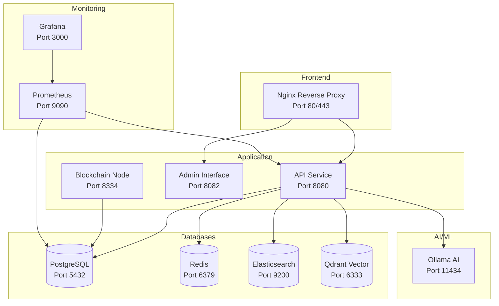

# 🐳 DATA_BOT v4 - Solution Docker Production

[](https://docs.docker.com/)
[](https://docs.docker.com/compose/)
[](#sécurité)

Solution Docker complète et optimisée pour DATA_BOT v4 avec architecture microservices, sécurité renforcée et monitoring intégré.

## 📋 Table des matières

- [🏗️ Architecture](#architecture)
- [🚀 Démarrage rapide](#démarrage-rapide)
- [🔧 Configuration](#configuration)
- [🛡️ Sécurité](#sécurité)
- [📊 Monitoring](#monitoring)
- [🔄 Déploiement](#déploiement)
- [🚨 Dépannage](#dépannage)

## 🏗️ Architecture

### Services déployés



### Structure des fichiers

```
docker/
├── Dockerfile.api           # Service API principal optimisé
├── Dockerfile.blockchain    # Nœud blockchain spécialisé
├── Dockerfile.admin        # Interface d'administration
├── Dockerfile.nginx        # Reverse proxy sécurisé
├── docker-compose.yml      # Configuration développement
├── docker-compose.prod.yml # Configuration production
├── .dockerignore           # Optimisation build
├── .env.example           # Variables d'environnement
├── scripts/
│   ├── deploy.sh          # Script de déploiement
│   └── monitor.sh         # Script de monitoring
├── secrets/               # Secrets management
└── README.md             # Cette documentation
```

## 🚀 Démarrage rapide

### Prérequis

- Docker 20.10+ et Docker Compose 2.0+
- 8GB RAM minimum (16GB recommandé pour production)
- 50GB d'espace disque libre

### Installation en 3 étapes

1. **Cloner et configurer**
   ```bash
   git clone <repository>
   cd DATA_BOT/docker
   cp .env.example .env
   ```

2. **Déployer l'application**
   ```bash
   ./scripts/deploy.sh deploy
   ```

3. **Vérifier le déploiement**
   ```bash
   ./scripts/monitor.sh status
   ```

### Accès aux services

| Service | URL | Description |
|---------|-----|-------------|
| **Interface principale** | http://localhost | Interface web DATA_BOT |
| **Admin Dashboard** | http://localhost/admin | Interface d'administration |
| **API REST** | http://localhost:8080 | API REST v4 |
| **GraphQL** | http://localhost/graphql | API GraphQL |
| **Grafana** | http://localhost:3000 | Monitoring (admin/password) |
| **Prometheus** | http://localhost:9090 | Métriques |

## 🔧 Configuration

### Variables d'environnement

Copiez `.env.example` vers `.env` et adaptez selon vos besoins :

```bash
# Environnement
ENVIRONMENT=development|staging|production
TAG=latest
DOCKER_REGISTRY=docker.io

# Base de données
POSTGRES_DB=databot_v4
POSTGRES_USER=databot

# Domaine et SSL
DOMAIN=databot.local
SSL_CERT_PATH=./ssl

# Scaling (production)
API_REPLICAS=3
ADMIN_REPLICAS=2
```

### Secrets management

Les mots de passe sont générés automatiquement dans `secrets/` :

```bash
secrets/
├── postgres_password.txt    # PostgreSQL
├── redis_password.txt       # Redis
├── grafana_password.txt     # Grafana
├── ssl_cert.pem            # Certificat SSL
└── ssl_key.pem             # Clé privée SSL
```

### Configuration par environnement

#### Développement
```bash
./scripts/deploy.sh deploy -e development
```

#### Staging
```bash
./scripts/deploy.sh deploy -e staging -t v1.2.3
```

#### Production
```bash
./scripts/deploy.sh deploy -e production -t v1.2.3 -r registry.company.com
```

## 🛡️ Sécurité

### Mesures de sécurité implémentées

✅ **Utilisateurs non-root** dans tous les conteneurs
✅ **Images Alpine/Distroless** pour réduire la surface d'attaque
✅ **Multi-stage builds** pour minimiser la taille des images
✅ **Secrets management** avec Docker secrets
✅ **Réseaux isolés** par fonction
✅ **TLS/SSL** avec certificats auto-signés ou Let's Encrypt
✅ **Health checks** détaillés pour tous les services
✅ **Resource limits** pour éviter l'épuisement des ressources

### Scan de sécurité

```bash
# Scan des vulnérabilités
docker scout cves databot/api:latest

# Scan avec Trivy
trivy image databot/api:latest
```

### Durcissement Nginx

- Headers de sécurité (HSTS, CSP, X-Frame-Options)
- Chiffrement TLS 1.2+ uniquement
- Rate limiting intégré
- Protection DDoS basique

## 📊 Monitoring

### Monitoring automatique

Le système inclut un monitoring complet :

```bash
# Status unique
./scripts/monitor.sh status

# Monitoring continu
./scripts/monitor.sh monitor -i 30

# Génération de rapport
./scripts/monitor.sh report > health_report.json
```

### Métriques surveillées

- **Santé des conteneurs** (running/stopped/failed)
- **Endpoints HTTP** (health checks applicatifs)
- **Ressources système** (CPU/RAM/Disk)
- **Base de données** (connexions PostgreSQL/Redis)
- **Logs d'erreur** (détection automatique)

### Alerting

Configuration webhook Slack/Teams :

```bash
./scripts/monitor.sh monitor -w https://hooks.slack.com/your-webhook
```

### Dashboards Grafana

Dashboards pré-configurés disponibles :

- **Vue d'ensemble système** - Métriques générales
- **Performance application** - Latence et throughput
- **Blockchain monitoring** - État des nœuds et consensus
- **Base de données** - Performance PostgreSQL/Redis

## 🔄 Déploiement

### Scripts de déploiement

```bash
# Déploiement complet
./scripts/deploy.sh deploy -e production -t v1.2.3

# Build uniquement
./scripts/deploy.sh build --force

# Rollback
./scripts/deploy.sh rollback

# Sauvegarde
./scripts/deploy.sh backup

# Nettoyage
./scripts/deploy.sh cleanup
```

### Stratégie blue-green

Pour un déploiement sans interruption :

```bash
# 1. Déployer nouvelle version
TAG=v1.2.3 ./scripts/deploy.sh deploy -e production

# 2. Health check automatique
./scripts/monitor.sh health

# 3. Rollback si nécessaire
./scripts/deploy.sh rollback
```

### CI/CD Pipeline

Exemple avec GitHub Actions :

```yaml
name: Deploy DATA_BOT
on:
  push:
    tags: ['v*']

jobs:
  deploy:
    runs-on: ubuntu-latest
    steps:
      - uses: actions/checkout@v3
      - name: Deploy to production
        env:
          DOCKER_REGISTRY: ${{ secrets.DOCKER_REGISTRY }}
          TAG: ${{ github.ref_name }}
        run: |
          cd docker
          ./scripts/deploy.sh deploy -e production -t $TAG
```

## 🚨 Dépannage

### Problèmes courants

#### Services ne démarrent pas

```bash
# Vérifier les logs
./scripts/deploy.sh logs databot-api

# Vérifier l'état des conteneurs
docker ps -a

# Redémarrer un service
docker-compose restart databot-api
```

#### Problèmes de performance

```bash
# Monitoring des ressources
./scripts/monitor.sh resources

# Stats Docker en temps réel
docker stats

# Vérifier les limits
docker inspect databot-api | grep -A 10 Resources
```

#### Problèmes de connectivité

```bash
# Tester les endpoints
curl http://localhost:8080/health
curl http://localhost:8082/_stcore/health

# Vérifier les réseaux
docker network ls
docker network inspect databot-frontend
```

#### Base de données

```bash
# Connexion PostgreSQL
docker exec -it databot-postgres psql -U databot -d databot_v4

# Vérifier Redis
docker exec -it databot-redis redis-cli ping

# Backup/Restore
./scripts/deploy.sh backup
```

### Logs et debugging

```bash
# Logs en temps réel
./scripts/deploy.sh logs

# Logs d'un service spécifique
./scripts/deploy.sh logs databot-api

# Logs avec grep
docker-compose logs databot-api | grep ERROR
```

### Performance tuning

#### Pour production avec beaucoup de charge :

```bash
# Augmenter les répliques API
export API_REPLICAS=5
./scripts/deploy.sh deploy -e production

# Optimiser PostgreSQL
# Voir docker-compose.prod.yml pour les paramètres avancés

# Monitoring avancé
./scripts/monitor.sh monitor -i 10 -w $SLACK_WEBHOOK
```

## 🔧 Maintenance

### Mises à jour

```bash
# Mise à jour vers nouvelle version
./scripts/deploy.sh deploy -t v1.3.0

# Mise à jour des images de base
docker-compose pull
./scripts/deploy.sh build --force
```

### Sauvegardes

```bash
# Sauvegarde manuelle
./scripts/deploy.sh backup

# Sauvegarde automatique (cron)
0 2 * * * /path/to/docker/scripts/deploy.sh backup
```

### Nettoyage

```bash
# Nettoyage des ressources inutilisées
./scripts/deploy.sh cleanup

# Nettoyage forcé
docker system prune -a --force
```

## 📚 Ressources additionnelles

- [Documentation Docker](https://docs.docker.com/)
- [Best Practices Security](https://docs.docker.com/develop/security-best-practices/)
- [Docker Compose Production](https://docs.docker.com/compose/production/)
- [Monitoring Containers](https://docs.docker.com/config/containers/logging/)

## 🆘 Support

Pour obtenir de l'aide :

1. Vérifiez d'abord les [problèmes courants](#problèmes-courants)
2. Consultez les logs avec `./scripts/deploy.sh logs`
3. Utilisez le monitoring pour diagnostiquer : `./scripts/monitor.sh status`
4. Ouvrez une issue avec les détails du problème

---

**🚀 DATA_BOT v4 - Solution Docker Enterprise-ready**