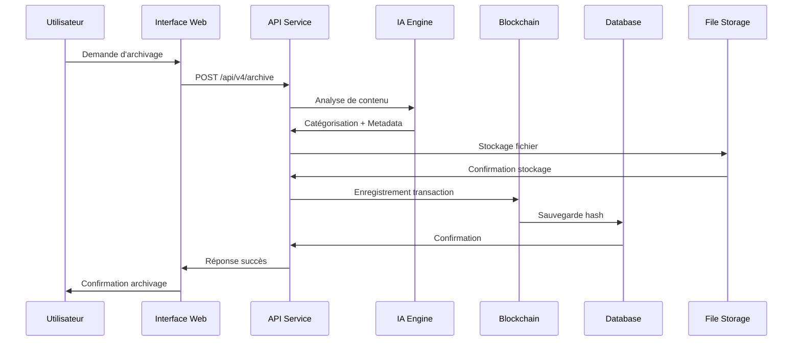
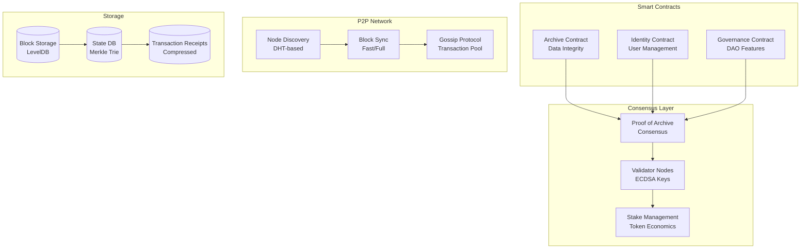
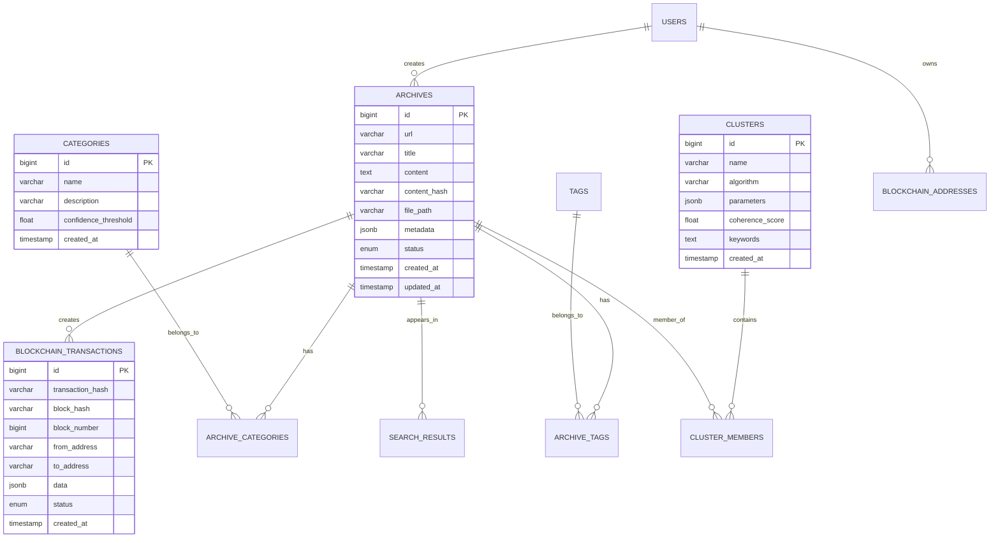
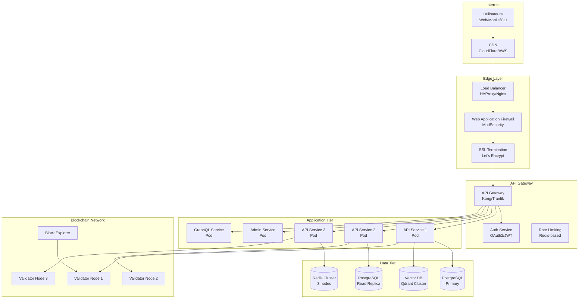
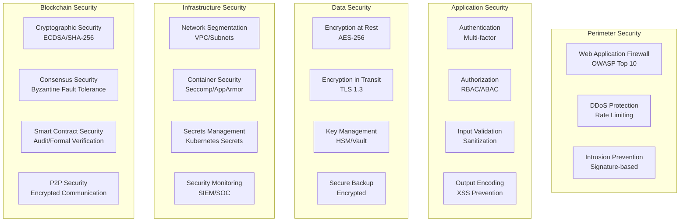

# 🏗️ Architecture DATA_BOT v4


Documentation complète de l'architecture de DATA_BOT v4, une plateforme d'archivage web décentralisée enterprise-ready.

## 📋 Table des Matières

- [🎯 Vue d'ensemble](#-vue-densemble)
- [🏛️ Architecture Générale](#️-architecture-générale)
- [🔧 Composants Principaux](#-composants-principaux)
- [🔗 Architecture Blockchain](#-architecture-blockchain)
- [💾 Architecture des Données](#-architecture-des-données)
- [🌐 Architecture Réseau](#-architecture-réseau)
- [🔒 Architecture de Sécurité](#-architecture-de-sécurité)
- [📈 Architecture de Performance](#-architecture-de-performance)
- [☸️ Architecture Cloud-Native](#️-architecture-cloud-native)

## 🎯 Vue d'ensemble

DATA_BOT v4 adopte une architecture microservices cloud-native avec les principes suivants :

### Principes Architecturaux

- **🔄 Microservices** : Services découplés et indépendants
- **📦 Containerisation** : Docker + Kubernetes pour l'orchestration
- **🔗 Blockchain-First** : Intégrité et traçabilité par design
- **🤖 AI-Driven** : Intelligence artificielle intégrée à tous les niveaux
- **🛡️ Security-by-Design** : Sécurité intégrée dès la conception
- **📊 Observability** : Monitoring et logging complets
- **⚡ Performance** : Optimisation pour la scalabilité

### Évolution Architecturale

| Version | Architecture | Caractéristiques Principales |
|---------|--------------|------------------------------|
| **v1** | Monolithe | Bot simple avec Ollama |
| **v2** | Modulaire | Interface web + API REST |
| **v3** | Distribuée | Elasticsearch + Vector Search |
| **v4** | Cloud-Native | Blockchain + Microservices + K8s |

## 🏛️ Architecture Générale

### Vue d'ensemble du Système

```mermaid
graph TB
    subgraph "Interface Layer"
        UI[Web Interface<br/>React/Vue]
        Admin[Admin Dashboard<br/>Streamlit]
        Mobile[Mobile App<br/>PWA]
        CLI[CLI Tools<br/>Python]
    end
    
    subgraph "API Gateway Layer"
        Gateway[API Gateway<br/>Nginx/Traefik]
        Auth[Authentication<br/>JWT/OAuth2]
        RateLimit[Rate Limiting<br/>Redis]
    end
    
    subgraph "Application Layer"
        API[API Service v4<br/>FastAPI]
        GraphQL[GraphQL Service<br/>Strawberry]
        Stream[Stream Processor<br/>WebSocket]
        Scheduler[Task Scheduler<br/>Celery]
    end
    
    subgraph "Business Logic Layer"
        Archive[Archive Manager<br/>Core Logic]
        AI[AI Engine<br/>ML/LLM]
        Search[Search Engine<br/>ES/OpenSearch]
        Cluster[Clustering Engine<br/>HDBSCAN]
    end
    
    subgraph "Blockchain Layer"
        Chain[ArchiveChain<br/>Consensus PoA]
        Contracts[Smart Contracts<br/>Solidity-like]
        P2P[P2P Network<br/>Node Discovery]
        RPC[Blockchain RPC<br/>JSON-RPC]
    end
    
    subgraph "Data Layer"
        Postgres[(PostgreSQL<br/>Primary DB)]
        Redis[(Redis<br/>Cache/Sessions)]
        Vector[(Vector DB<br/>Qdrant/Chroma)]
        Files[File Storage<br/>S3/MinIO]
        Elastic[(Elasticsearch<br/>Search Index)]
    end
    
    subgraph "Infrastructure Layer"
        Monitor[Monitoring<br/>Prometheus/Grafana]
        Logs[Logging<br/>ELK Stack]
        Backup[Backup<br/>Automated)]
        Security[Security<br/>SIEM/IDS]
    end
    
    UI --> Gateway
    Admin --> Gateway
    Mobile --> Gateway
    CLI --> API
    
    Gateway --> Auth
    Gateway --> API
    Gateway --> GraphQL
    
    API --> Archive
    API --> AI
    API --> Search
    GraphQL --> Archive
    
    Archive --> Chain
    AI --> Vector
    Search --> Elastic
    
    Chain --> Postgres
    Archive --> Files
    Search --> Redis
    
    Monitor --> API
    Monitor --> Chain
    Logs --> API
    Security --> Gateway
```

### Flux de Données Principal



## 🔧 Composants Principaux

### 1. API Service v4 ([`src/api_server_v4.py`](../src/api_server_v4.py))

**Responsabilités :**
- Exposition des APIs REST et WebSocket
- Orchestration des services métier
- Gestion de l'authentification et autorisation
- Validation des requêtes et réponses

**Technologies :**
- FastAPI pour l'API REST
- WebSocket pour les communications temps réel
- Pydantic pour la validation de données
- JWT pour l'authentification

**Endpoints Principaux :**
```python
# Archive Management
POST   /api/v4/archive              # Créer une nouvelle archive
GET    /api/v4/archive/{id}         # Récupérer une archive
PUT    /api/v4/archive/{id}         # Mettre à jour une archive
DELETE /api/v4/archive/{id}         # Supprimer une archive

# Search & Discovery
POST   /api/v4/search               # Recherche simple
POST   /api/v4/search/advanced      # Recherche avancée
GET    /api/v4/search/suggestions   # Suggestions de recherche

# Machine Learning
POST   /api/v4/ml/categorize        # Catégorisation automatique
POST   /api/v4/ml/train            # Entraînement de modèle
GET    /api/v4/ml/models           # Liste des modèles

# Clustering
POST   /api/v4/clustering/run       # Lancer clustering
GET    /api/v4/clustering/results   # Résultats de clustering

# Blockchain
GET    /api/v4/blockchain/status    # État de la blockchain
POST   /api/v4/blockchain/verify    # Vérifier intégrité
GET    /api/v4/blockchain/explorer  # Explorateur de blocs
```

### 2. Admin Interface ([`src/admin_interface.py`](../src/admin_interface.py))

**Responsabilités :**
- Interface d'administration Streamlit
- Dashboard de monitoring temps réel
- Gestion des utilisateurs et permissions
- Configuration système avancée

**Fonctionnalités :**
- 📊 Dashboard avec métriques temps réel
- 🔍 Recherche et exploration avancée
- 📚 Gestion complète des ressources
- 🏷️ Gestion des catégories et tags
- 🧬 Configuration et lancement de clustering
- 🤖 Entraînement et gestion des modèles ML
- 📈 Monitoring système complet

### 3. GraphQL Server ([`src/graphql_server.py`](../src/graphql_server.py))

**Responsabilités :**
- API GraphQL pour requêtes complexes
- Support des subscriptions temps réel
- Optimisation des requêtes N+1
- Schema introspection

**Schema Principal :**
```graphql
type Query {
  # Archives
  archive(id: ID!): Archive
  archives(filter: ArchiveFilter, pagination: Pagination): ArchiveConnection
  
  # Search
  search(query: String!, options: SearchOptions): SearchResult
  
  # Blockchain
  blockchain: BlockchainInfo
  block(hash: String!): Block
  transaction(hash: String!): Transaction
  
  # ML & Clustering
  clusters(algorithm: String): [Cluster]
  models: [MLModel]
}

type Mutation {
  # Archive operations
  createArchive(input: CreateArchiveInput!): Archive
  updateArchive(id: ID!, input: UpdateArchiveInput!): Archive
  deleteArchive(id: ID!): Boolean
  
  # ML operations
  categorizeResource(id: ID!): Archive
  trainModel(input: TrainModelInput!): MLModel
  
  # Clustering
  clusterResources(algorithm: String!): [Cluster]
}

type Subscription {
  # Real-time updates
  archiveUpdated(id: ID): Archive
  blockchainEvent: BlockchainEvent
  clusteringProgress: ClusteringProgress
}
```

### 4. ML Categorizer ([`src/ml_categorizer.py`](../src/ml_categorizer.py))

**Responsabilités :**
- Catégorisation automatique du contenu
- Entraînement de modèles personnalisés
- Évaluation et métriques de performance
- Support multi-modèles

**Algorithmes Supportés :**
- **Naive Bayes + TF-IDF** : Rapide, précis pour texte
- **Transformers (BERT/DistilBERT)** : Précision maximum
- **Zero-shot Classification** : Sans entraînement préalable
- **Custom Models** : Modèles spécialisés

**Pipeline ML :**
```python
# 1. Préprocessing
text = preprocess_content(raw_content)

# 2. Feature Extraction
features = extract_features(text, method="tfidf|transformers")

# 3. Classification
categories = classify(features, model="naive_bayes|transformers")

# 4. Post-processing
final_categories = post_process(categories, confidence_threshold=0.3)
```

### 5. Result Clusterer ([`src/result_clusterer.py`](../src/result_clusterer.py))

**Responsabilités :**
- Clustering automatique des résultats de recherche
- Génération de recommandations
- Visualisation des clusters
- Optimisation des algorithmes

**Algorithmes Disponibles :**
- **HDBSCAN** : Clustering basé sur la densité (recommandé)
- **K-means** : Clustering par centroïdes
- **Agglomerative** : Clustering hiérarchique
- **DBSCAN** : Clustering par densité avec paramètres fixes

**Processus de Clustering :**
```python
# 1. Vectorisation
vectors = vectorize_content(resources, method="tfidf|sentence_transformers")

# 2. Réduction de dimensionnalité
reduced_vectors = reduce_dimensions(vectors, method="pca|umap")

# 3. Clustering
clusters = cluster_algorithm.fit_predict(reduced_vectors)

# 4. Évaluation
silhouette_score = evaluate_clustering(vectors, clusters)

# 5. Labeling
cluster_labels = generate_cluster_labels(clusters, resources)
```

### 6. OpenSearch Manager ([`src/opensearch_manager.py`](../src/opensearch_manager.py))

**Responsabilités :**
- Alternative open-source à Elasticsearch
- Indexation et recherche haute performance
- Gestion des schémas et mappings
- Agrégations et analytics

**Configuration d'Index :**
```json
{
  "mappings": {
    "properties": {
      "title": {
        "type": "text",
        "analyzer": "french",
        "fields": {
          "keyword": {"type": "keyword"}
        }
      },
      "content": {
        "type": "text",
        "analyzer": "french"
      },
      "categories": {
        "type": "nested",
        "properties": {
          "name": {"type": "keyword"},
          "confidence": {"type": "float"}
        }
      },
      "embedding": {
        "type": "dense_vector",
        "dims": 768
      },
      "created_at": {
        "type": "date"
      }
    }
  }
}
```

## 🔗 Architecture Blockchain

### ArchiveChain Core



### Structure de Bloc

```python
class Block:
    def __init__(self):
        self.header = BlockHeader(
            parent_hash="0x...",           # Hash du bloc parent
            timestamp=int(time.time()),    # Timestamp Unix
            block_number=123456,           # Numéro de bloc
            merkle_root="0x...",          # Racine Merkle des transactions
            state_root="0x...",           # Racine de l'état global
            validator="0x...",            # Adresse du validateur
            signature="0x..."             # Signature ECDSA
        )
        self.transactions = [             # Liste des transactions
            ArchiveTransaction(),
            TokenTransaction(),
            GovernanceTransaction()
        ]
        self.hash = "0x..."              # Hash du bloc complet
```

### Smart Contracts

#### Archive Contract
```solidity
// Pseudo-code (implémenté en Python)
contract ArchiveContract {
    struct ArchiveRecord {
        string contentHash;      // Hash SHA-256 du contenu
        string metadataHash;     // Hash des métadonnées
        address archiver;        // Adresse de l'archiveur
        uint256 timestamp;       // Timestamp d'archivage
        bool isVerified;         // Statut de vérification
    }
    
    mapping(string => ArchiveRecord) public archives;
    
    function submitArchive(
        string memory _contentHash,
        string memory _metadataHash
    ) public returns (bool);
    
    function verifyArchive(string memory _contentHash) 
        public view returns (bool);
    
    function getArchiveRecord(string memory _contentHash) 
        public view returns (ArchiveRecord memory);
}
```

### Consensus Proof of Archive (PoA)

**Mécanisme :**
1. **Qualification des Validateurs** : Score basé sur l'historique d'archivage
2. **Rotation des Validateurs** : Prévention de la centralisation
3. **Slashing** : Pénalités pour mauvais comportement
4. **Récompenses** : Tokens pour validation correcte

**Calcul du Score PoA :**
```python
def calculate_poa_score(validator_address: str) -> float:
    """Calcule le score Proof of Archive d'un validateur"""
    
    # Facteurs du score
    archive_count = get_archive_count(validator_address)
    quality_score = get_archive_quality_score(validator_address)
    stake_amount = get_stake_amount(validator_address)
    uptime = get_validator_uptime(validator_address)
    
    # Formule pondérée
    score = (
        archive_count * 0.3 +      # 30% - Quantité d'archives
        quality_score * 0.4 +       # 40% - Qualité des archives
        stake_amount * 0.2 +        # 20% - Montant de stake
        uptime * 0.1               # 10% - Temps de fonctionnement
    )
    
    return min(score, 1.0)  # Normalisation à 1.0 max
```

## 💾 Architecture des Données

### Modèle de Données Relationnel



### Schéma des Collections NoSQL

#### Vector Database (Qdrant)
```json
{
  "collection_name": "archive_embeddings",
  "vectors": {
    "size": 768,
    "distance": "Cosine"
  },
  "payload_schema": {
    "archive_id": "integer",
    "title": "keyword",
    "categories": ["keyword"],
    "created_at": "datetime",
    "content_type": "keyword"
  }
}
```

#### Search Index (OpenSearch)
```json
{
  "index_name": "databot_archives",
  "settings": {
    "number_of_shards": 3,
    "number_of_replicas": 1,
    "analysis": {
      "analyzer": {
        "french_analyzer": {
          "tokenizer": "standard",
          "filter": ["lowercase", "french_stop", "french_stemmer"]
        }
      }
    }
  },
  "mappings": {
    "properties": {
      "title": {
        "type": "text",
        "analyzer": "french_analyzer"
      },
      "content": {
        "type": "text",
        "analyzer": "french_analyzer"
      },
      "embedding": {
        "type": "dense_vector",
        "dims": 768,
        "index": true,
        "similarity": "cosine"
      }
    }
  }
}
```

### Cache Strategy (Redis)

```python
# Structure des clés Redis
CACHE_PATTERNS = {
    "search_results": "search:{query_hash}:{page}:{filters_hash}",
    "archive_metadata": "archive:{archive_id}:metadata",
    "user_session": "session:{session_id}",
    "clustering_cache": "cluster:{algorithm}:{params_hash}",
    "ml_predictions": "ml:{model_id}:{content_hash}",
    "blockchain_state": "blockchain:state:{block_number}"
}

# Stratégies d'expiration
CACHE_TTL = {
    "search_results": 3600,      # 1 heure
    "archive_metadata": 86400,   # 24 heures
    "user_session": 1800,        # 30 minutes
    "clustering_cache": 7200,    # 2 heures
    "ml_predictions": 604800,    # 1 semaine
    "blockchain_state": 300      # 5 minutes
}
```

## 🌐 Architecture Réseau

### Topologie de Réseau



### Sécurité Réseau

#### Network Policies (Kubernetes)
```yaml
apiVersion: networking.k8s.io/v1
kind: NetworkPolicy
metadata:
  name: databot-network-policy
spec:
  podSelector:
    matchLabels:
      app: databot
  policyTypes:
  - Ingress
  - Egress
  ingress:
  - from:
    - namespaceSelector:
        matchLabels:
          name: databot
    ports:
    - protocol: TCP
      port: 8080
  egress:
  - to:
    - namespaceSelector:
        matchLabels:
          name: databot
    ports:
    - protocol: TCP
      port: 5432  # PostgreSQL
    - protocol: TCP
      port: 6379  # Redis
```

#### TLS Configuration
```nginx
# Nginx SSL Configuration
ssl_protocols TLSv1.2 TLSv1.3;
ssl_ciphers ECDHE-RSA-AES256-GCM-SHA512:DHE-RSA-AES256-GCM-SHA512;
ssl_prefer_server_ciphers off;
ssl_session_cache shared:SSL:10m;
ssl_session_timeout 24h;
ssl_session_tickets off;

# HSTS
add_header Strict-Transport-Security "max-age=63072000" always;

# Content Security Policy
add_header Content-Security-Policy "default-src 'self'; script-src 'self' 'unsafe-inline'; style-src 'self' 'unsafe-inline'";
```

## 🔒 Architecture de Sécurité

### Sécurité Multi-Couches



### Authentification et Autorisation

#### JWT Token Structure
```python
# JWT Header
{
    "alg": "RS256",
    "typ": "JWT",
    "kid": "key-id-1"
}

# JWT Payload
{
    "sub": "user-id-123",
    "iss": "databot-v4",
    "aud": "databot-api",
    "exp": 1640995200,
    "iat": 1640991600,
    "roles": ["user", "archiver"],
    "permissions": [
        "archives:read",
        "archives:create",
        "search:execute"
    ],
    "blockchain_address": "0x742d35Cc6...",
    "mfa_verified": true
}
```

#### RBAC (Role-Based Access Control)
```yaml
# Rôles et permissions
roles:
  guest:
    permissions:
      - "archives:read"
      - "search:execute"
  
  user:
    inherits: ["guest"]
    permissions:
      - "archives:create"
      - "archives:update:own"
      - "categories:read"
  
  archiver:
    inherits: ["user"]
    permissions:
      - "archives:delete:own"
      - "ml:categorize"
      - "clustering:execute"
  
  admin:
    inherits: ["archiver"]
    permissions:
      - "archives:*"
      - "users:*"
      - "system:*"
      - "blockchain:admin"
  
  validator:
    inherits: ["archiver"]
    permissions:
      - "blockchain:validate"
      - "consensus:participate"
      - "staking:manage"
```

### Cryptographie et Sécurité Blockchain

#### Gestion des Clés ECDSA
```python
class KeyManager:
    def __init__(self):
        self.curve = secp256k1
        self.key_store = secure_key_storage()
    
    def generate_keypair(self) -> Tuple[PrivateKey, PublicKey]:
        """Génère une paire de clés ECDSA sécurisée"""
        private_key = self.curve.generate_private_key()
        public_key = private_key.public_key()
        return private_key, public_key
    
    def sign_transaction(self, transaction: Transaction, 
                        private_key: PrivateKey) -> str:
        """Signe une transaction avec ECDSA"""
        message_hash = transaction.get_hash()
        signature = private_key.sign(
            message_hash,
            ec.ECDSA(hashes.SHA256())
        )
        return signature.hex()
    
    def verify_signature(self, transaction: Transaction,
                        signature: str, public_key: PublicKey) -> bool:
        """Vérifie une signature ECDSA"""
        try:
            message_hash = transaction.get_hash()
            public_key.verify(
                bytes.fromhex(signature),
                message_hash,
                ec.ECDSA(hashes.SHA256())
            )
            return True
        except InvalidSignature:
            return False
```

## 📈 Architecture de Performance

### Stratégies d'Optimisation

#### Mise en Cache Multi-Niveaux
```python
# L1 Cache - Application Memory
@lru_cache(maxsize=1000)
def get_archive_metadata(archive_id: int) -> Dict:
    return fetch_from_database(archive_id)

# L2 Cache - Redis
async def get_search_results(query: str, page: int) -> List[Dict]:
    cache_key = f"search:{hash(query)}:{page}"
    cached = await redis.get(cache_key)
    if cached:
        return json.loads(cached)
    
    results = await execute_search(query, page)
    await redis.setex(cache_key, 3600, json.dumps(results))
    return results

# L3 Cache - CDN
# Configuration via headers HTTP
Cache-Control: public, max-age=86400
ETag: "version-123"
```

#### Optimisation Base de Données

```sql
-- Index composites pour requêtes fréquentes
CREATE INDEX CONCURRENTLY idx_archives_category_date 
ON archives(category, created_at DESC);

CREATE INDEX CONCURRENTLY idx_archives_content_hash 
ON archives USING hash(content_hash);

-- Partitioning par date
CREATE TABLE archives_y2024m01 PARTITION OF archives
FOR VALUES FROM ('2024-01-01') TO ('2024-02-01');

-- Analyse des requêtes lentes
SELECT query, mean_time, calls, total_time
FROM pg_stat_statements
WHERE mean_time > 100
ORDER BY mean_time DESC;
```

#### Optimisation Recherche

```python
# Recherche hybride optimisée
class HybridSearchEngine:
    def __init__(self):
        self.keyword_engine = OpenSearchManager()
        self.vector_engine = QdrantManager()
        self.cache = RedisCache()
    
    async def search(self, query: str, options: SearchOptions) -> SearchResults:
        # 1. Cache check
        cache_key = self.generate_cache_key(query, options)
        cached_results = await self.cache.get(cache_key)
        if cached_results:
            return cached_results
        
        # 2. Recherche parallèle
        keyword_task = self.keyword_engine.search(query, options)
        vector_task = self.vector_engine.similarity_search(query, options)
        
        keyword_results, vector_results = await asyncio.gather(
            keyword_task, vector_task
        )
        
        # 3. Fusion des résultats
        merged_results = self.merge_results(
            keyword_results, vector_results, 
            weights=[0.7, 0.3]  # Pondération keyword vs vector
        )
        
        # 4. Mise en cache
        await self.cache.set(cache_key, merged_results, ttl=3600)
        
        return merged_results
```

### Monitoring des Performances

#### Métriques Clés
```python
# Métriques applicatives
METRICS = {
    # Latence API
    "api_request_duration_seconds": Histogram(
        "api_request_duration_seconds",
        "Durée des requêtes API",
        ["method", "endpoint", "status_code"]
    ),
    
    # Throughput
    "api_requests_total": Counter(
        "api_requests_total",
        "Nombre total de requêtes API",
        ["method", "endpoint"]
    ),
    
    # Recherche
    "search_duration_seconds": Histogram(
        "search_duration_seconds",
        "Durée des recherches",
        ["engine", "query_type"]
    ),
    
    # ML
    "ml_categorization_duration_seconds": Histogram(
        "ml_categorization_duration_seconds",
        "Durée de catégorisation ML",
        ["model", "content_type"]
    ),
    
    # Blockchain
    "blockchain_block_time_seconds": Histogram(
        "blockchain_block_time_seconds",
        "Temps de création de bloc",
        ["validator"]
    ),
    
    # Cache
    "cache_hit_ratio": Gauge(
        "cache_hit_ratio",
        "Ratio de hits cache",
        ["cache_type"]
    )
}
```

## ☸️ Architecture Cloud-Native

### Déploiement Kubernetes

#### Structure des Namespaces
```yaml
# Namespaces par environnement
apiVersion: v1
kind: Namespace
metadata:
  name: databot-production
  labels:
    environment: production
    app: databot
---
apiVersion: v1
kind: Namespace
metadata:
  name: databot-staging
  labels:
    environment: staging
    app: databot
---
apiVersion: v1
kind: Namespace
metadata:
  name: databot-monitoring
  labels:
    purpose: monitoring
    app: databot
```

#### Auto-scaling Configuration
```yaml
# Horizontal Pod Autoscaler
apiVersion: autoscaling/v2
kind: HorizontalPodAutoscaler
metadata:
  name: databot-api-hpa
spec:
  scaleTargetRef:
    apiVersion: apps/v1
    kind: Deployment
    name: databot-api
  minReplicas: 3
  maxReplicas: 50
  metrics:
  - type: Resource
    resource:
      name: cpu
      target:
        type: Utilization
        averageUtilization: 70
  - type: Resource
    resource:
      name: memory
      target:
        type: Utilization
        averageUtilization: 80
  - type: Pods
    pods:
      metric:
        name: custom_metric_qps
      target:
        type: AverageValue
        averageValue: "100"
```

#### Service Mesh (Istio)
```yaml
# Service Mesh Configuration
apiVersion: networking.istio.io/v1alpha3
kind: VirtualService
metadata:
  name: databot-api
spec:
  http:
  - match:
    - uri:
        prefix: /api/v4
  route:
  - destination:
      host: databot-api-service
      subset: v4
    weight: 90
  - destination:
      host: databot-api-service
      subset: v3
    weight: 10  # Canary deployment
  fault:
    delay:
      percentage:
        value: 0.1
      fixedDelay: 5s
  timeout: 30s
  retries:
    attempts: 3
    perTryTimeout: 10s
```

### Observabilité

#### Tracing Distribué (Jaeger)
```python
from opentelemetry import trace
from opentelemetry.instrumentation.fastapi import FastAPIInstrumentor

# Configuration du tracing
tracer = trace.get_tracer(__name__)

@app.post("/api/v4/archive")
async def create_archive(request: ArchiveRequest):
    with tracer.start_as_current_span("create_archive") as span:
        # Métadonnées de span
        span.set_attribute("archive.url", request.url)
        span.set_attribute("archive.size", len(request.content))
        
        # Traçage des opérations
        with tracer.start_as_current_span("ml_categorization"):
            categories = await ml_categorizer.categorize(request.content)
        
        with tracer.start_as_current_span("blockchain_transaction"):
            tx_hash = await blockchain.submit_archive(archive_data)
        
        with tracer.start_as_current_span("database_save"):
            archive_id = await db.save_archive(archive_data)
        
        span.set_attribute("archive.id", archive_id)
        span.set_attribute("blockchain.tx_hash", tx_hash)
        
        return {"archive_id": archive_id, "tx_hash": tx_hash}
```

Cette architecture complète assure la scalabilité, la sécurité et la maintenabilité de DATA_BOT v4 pour tous les environnements, du développement à la production enterprise.

---

## 📚 Ressources Complémentaires

- [Guide d'Installation](INSTALLATION.md) - Déploiement de l'architecture
- [API Reference](API_REFERENCE.md) - Intégration avec les APIs
- [Security Handbook](SECURITY_HANDBOOK.md) - Sécurité détaillée
- [Troubleshooting](TROUBLESHOOTING.md) - Résolution de problèmes architecturaux

**🏗️ Architecture DATA_BOT v4 - Conçue pour l'Enterprise et l'Avenir !**