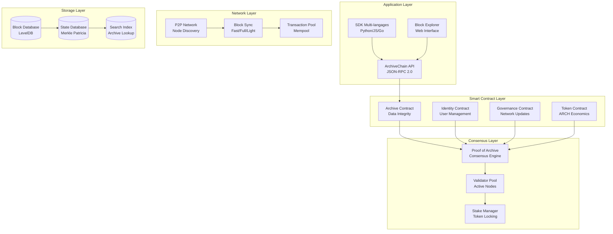

# 🔗 Guide Blockchain ArchiveChain


Guide complet de la blockchain ArchiveChain, le cœur décentralisé de DATA_BOT v4 pour l'intégrité et la traçabilité des archives.

## 📋 Table des Matières

- [🎯 Vue d'ensemble](#-vue-densemble)
- [🏗️ Architecture ArchiveChain](#️-architecture-archivechain)
- [⚡ Consensus Proof of Archive](#-consensus-proof-of-archive)
- [📜 Smart Contracts](#-smart-contracts)
- [🌐 Réseau P2P](#-réseau-p2p)
- [🔐 Cryptographie et Sécurité](#-cryptographie-et-sécurité)
- [💰 Économie des Tokens](#-économie-des-tokens)
- [🛠️ Développement](#️-développement)
- [🚀 Déploiement et Exploitation](#-déploiement-et-exploitation)

## 🎯 Vue d'ensemble

### Qu'est-ce qu'ArchiveChain ?

ArchiveChain est une blockchain spécialisée conçue pour garantir l'intégrité, la traçabilité et la pérennité des archives numériques. Elle utilise un mécanisme de consensus innovant appelé **Proof of Archive (PoA)** qui récompense la qualité de l'archivage plutôt que la puissance de calcul.

### Caractéristiques Principales

- **🎯 Spécialisée** : Conçue spécifiquement pour l'archivage numérique
- **♻️ Éco-responsable** : Consensus économe en énergie basé sur la qualité
- **🔒 Sécurisée** : Cryptographie ECDSA et hachage SHA-256
- **📈 Scalable** : Architecture optimisée pour de gros volumes
- **🤝 Interopérable** : APIs standard et SDK multi-langages
- **🌍 Décentralisée** : Réseau P2P avec gouvernance communautaire

### Cas d'Usage

| Secteur | Application | Avantages |
|---------|-------------|-----------|
| **Médias** | Archives journalistiques | Intégrité éditoriale, lutte contre la désinformation |
| **Recherche** | Publications scientifiques | Traçabilité des données, reproductibilité |
| **Patrimoine** | Numérisation culturelle | Préservation à long terme, authenticité |
| **Entreprise** | Conformité réglementaire | Audit trail, non-répudiation |
| **Juridique** | Preuves numériques | Horodatage certifié, chaîne de possession |

## 🏗️ Architecture ArchiveChain

### Structure Générale



### Composants Principaux

#### 1. Block Structure

```python
class Block:
    def __init__(self):
        self.header = BlockHeader(
            version=1,                    # Version du protocole
            parent_hash="0x...",         # Hash du bloc parent
            merkle_root="0x...",         # Racine Merkle des transactions
            state_root="0x...",          # Racine de l'état global
            timestamp=1642784400,        # Timestamp Unix
            block_number=123456,         # Numéro de bloc séquentiel
            validator_address="0x...",   # Adresse du validateur
            validator_signature="0x...", # Signature ECDSA du validateur
            difficulty=1000,             # Difficulté PoA
            gas_limit=8000000,          # Limite de gas
            gas_used=5234567,           # Gas utilisé
            extra_data=b"ArchiveChain"  # Données supplémentaires
        )
        self.transactions = []           # Liste des transactions
        self.hash = "0x..."             # Hash du bloc complet
```

#### 2. Transaction Types

```python
# Transaction d'archive
class ArchiveTransaction:
    def __init__(self):
        self.type = "archive"
        self.from_address = "0x..."     # Adresse de l'archiveur
        self.archive_id = 12345         # ID unique de l'archive
        self.content_hash = "sha256:..." # Hash du contenu
        self.metadata_hash = "sha256:..." # Hash des métadonnées
        self.timestamp = 1642784400     # Timestamp d'archivage
        self.gas_price = 20             # Prix du gas en Gwei
        self.gas_limit = 21000          # Limite de gas
        self.signature = "0x..."        # Signature ECDSA

# Transaction de token
class TokenTransaction:
    def __init__(self):
        self.type = "token"
        self.from_address = "0x..."
        self.to_address = "0x..."
        self.amount = Decimal("100.0")  # Montant en ARCH
        self.purpose = "reward"         # reward|stake|transfer
        self.signature = "0x..."

# Transaction de gouvernance
class GovernanceTransaction:
    def __init__(self):
        self.type = "governance"
        self.proposal_id = "prop_123"
        self.vote = "yes"               # yes|no|abstain
        self.voter_address = "0x..."
        self.voting_power = 1000        # Pouvoir de vote basé sur le stake
        self.signature = "0x..."
```

#### 3. State Management

```python
class ArchiveChainState:
    def __init__(self):
        # Archives enregistrées
        self.archives = {}  # archive_id -> ArchiveRecord
        
        # Comptes et balances
        self.accounts = {}  # address -> Account
        
        # Validateurs actifs
        self.validators = {}  # address -> ValidatorInfo
        
        # Gouvernance
        self.proposals = {}  # proposal_id -> Proposal
        
        # Métriques du réseau
        self.network_stats = NetworkStats()

class ArchiveRecord:
    def __init__(self):
        self.archive_id = 12345
        self.content_hash = "sha256:..."
        self.metadata_hash = "sha256:..."
        self.archiver_address = "0x..."
        self.block_number = 123456
        self.timestamp = 1642784400
        self.verification_count = 5
        self.is_verified = True
        self.quality_score = 0.95
```

## ⚡ Consensus Proof of Archive

### Principe du PoA

Le **Proof of Archive (PoA)** est un mécanisme de consensus innovant qui :

1. **Récompense la qualité** plutôt que la puissance de calcul
2. **Encourage l'archivage** de contenu de valeur
3. **Garantit la décentralisation** par rotation des validateurs
4. **Économise l'énergie** en évitant les calculs intensifs

### Calcul du Score PoA

```python
def calculate_poa_score(validator_address: str) -> float:
    """
    Calcule le score Proof of Archive d'un validateur
    Score = Qualité (40%) + Quantité (30%) + Stake (20%) + Uptime (10%)
    """
    
    # Facteur Qualité (40%) - Qualité moyenne des archives
    quality_metrics = get_quality_metrics(validator_address)
    quality_score = (
        quality_metrics.content_uniqueness * 0.3 +      # Unicité du contenu
        quality_metrics.metadata_completeness * 0.25 +   # Complétude des métadonnées
        quality_metrics.verification_rate * 0.25 +       # Taux de vérification
        quality_metrics.community_rating * 0.2           # Note de la communauté
    )
    
    # Facteur Quantité (30%) - Volume d'archives (avec diminishing returns)
    archive_count = get_archive_count(validator_address)
    quantity_score = min(1.0, math.log10(max(1, archive_count)) / 3.0)
    
    # Facteur Stake (20%) - Montant de tokens stakés
    stake_amount = get_stake_amount(validator_address)
    max_stake = get_max_stake_in_network()
    stake_score = min(1.0, stake_amount / max_stake)
    
    # Facteur Uptime (10%) - Disponibilité du nœud
    uptime = get_validator_uptime(validator_address)
    uptime_score = uptime  # Déjà en pourcentage 0-1
    
    # Score final pondéré
    final_score = (
        quality_score * 0.4 +
        quantity_score * 0.3 +
        stake_score * 0.2 +
        uptime_score * 0.1
    )
    
    return min(final_score, 1.0)
```

### Sélection des Validateurs

```python
class ValidatorSelection:
    def __init__(self):
        self.min_score_threshold = 0.3      # Score minimum pour validation
        self.max_consecutive_blocks = 2     # Limite de blocs consécutifs
        self.rotation_probability = 0.1     # Probabilité de rotation forcée
    
    def select_next_validator(self, current_validator: str) -> str:
        """Sélectionne le prochain validateur selon l'algorithme PoA"""
        
        # 1. Obtenir tous les validateurs éligibles
        eligible_validators = self.get_eligible_validators()
        
        # 2. Filtrer par score minimum
        qualified = [
            v for v in eligible_validators
            if calculate_poa_score(v.address) >= self.min_score_threshold
        ]
        
        # 3. Exclure le validateur actuel si rotation nécessaire
        if self.should_rotate(current_validator):
            qualified = [v for v in qualified if v.address != current_validator]
        
        # 4. Sélection pondérée par score PoA
        weights = [calculate_poa_score(v.address) for v in qualified]
        selected = random.choices(qualified, weights=weights, k=1)[0]
        
        return selected.address
    
    def should_rotate(self, validator: str) -> bool:
        """Détermine si une rotation est nécessaire"""
        consecutive_blocks = get_consecutive_blocks(validator)
        
        if consecutive_blocks >= self.max_consecutive_blocks:
            return True
        
        if random.random() < self.rotation_probability:
            return True
        
        return False
```

### Validation des Blocs

```python
class BlockValidator:
    def validate_block(self, block: Block) -> bool:
        """Valide un bloc selon les règles PoA"""
        
        # 1. Validation de la structure
        if not self.validate_structure(block):
            return False
        
        # 2. Validation du validateur
        if not self.validate_validator_authority(block):
            return False
        
        # 3. Validation des transactions
        if not self.validate_transactions(block):
            return False
        
        # 4. Validation de la signature
        if not self.validate_signature(block):
            return False
        
        # 5. Validation de la continuité
        if not self.validate_chain_continuity(block):
            return False
        
        return True
    
    def validate_validator_authority(self, block: Block) -> bool:
        """Vérifie que le validateur a l'autorité de créer ce bloc"""
        validator = block.header.validator_address
        
        # Vérifier le score PoA minimum
        score = calculate_poa_score(validator)
        if score < 0.3:
            return False
        
        # Vérifier la rotation
        if self.violates_rotation_rules(validator, block.header.block_number):
            return False
        
        # Vérifier le stake minimum
        stake = get_stake_amount(validator)
        if stake < self.min_stake_requirement:
            return False
        
        return True
```

## 📜 Smart Contracts

ArchiveChain intègre un système de smart contracts spécialisé pour l'archivage. Les contrats sont écrits en Python et compilés en bytecode optimisé.

### Archive Contract

```python
class ArchiveContract:
    """Contrat principal pour la gestion des archives"""
    
    def __init__(self):
        self.archives = {}  # content_hash -> ArchiveData
        self.owner = msg.sender
        self.archive_fee = Decimal("1.0")  # Frais en ARCH
    
    def submit_archive(self, 
                      content_hash: str,
                      metadata_hash: str,
                      archive_id: int) -> bool:
        """Soumet une nouvelle archive à la blockchain"""
        
        # Validation des paramètres
        require(len(content_hash) == 66, "Hash de contenu invalide")
        require(len(metadata_hash) == 66, "Hash de métadonnées invalide")
        require(archive_id > 0, "ID d'archive invalide")
        
        # Vérifier que l'archive n'existe pas déjà
        require(content_hash not in self.archives, "Archive déjà existante")
        
        # Vérifier le paiement des frais
        require(msg.value >= self.archive_fee, "Frais insuffisants")
        
        # Créer l'enregistrement d'archive
        archive_data = ArchiveData(
            content_hash=content_hash,
            metadata_hash=metadata_hash,
            archive_id=archive_id,
            archiver=msg.sender,
            timestamp=block.timestamp,
            block_number=block.number,
            verification_count=0,
            is_verified=False
        )
        
        # Enregistrer dans l'état
        self.archives[content_hash] = archive_data
        
        # Émettre un événement
        emit ArchiveSubmitted(
            content_hash=content_hash,
            archiver=msg.sender,
            archive_id=archive_id,
            timestamp=block.timestamp
        )
        
        return True
    
    def verify_archive(self, content_hash: str) -> bool:
        """Vérifie l'intégrité d'une archive"""
        
        require(content_hash in self.archives, "Archive non trouvée")
        
        archive = self.archives[content_hash]
        
        # Incrémenter le compteur de vérifications
        archive.verification_count += 1
        
        # Marquer comme vérifiée si seuil atteint
        if archive.verification_count >= 3:
            archive.is_verified = True
            
            # Récompenser l'archiveur
            reward_amount = self.calculate_reward(archive)
            transfer_tokens(archive.archiver, reward_amount)
            
            emit ArchiveVerified(
                content_hash=content_hash,
                verifier=msg.sender,
                reward=reward_amount
            )
        
        return True
    
    def get_archive(self, content_hash: str) -> ArchiveData:
        """Récupère les données d'une archive"""
        require(content_hash in self.archives, "Archive non trouvée")
        return self.archives[content_hash]
    
    def calculate_reward(self, archive: ArchiveData) -> Decimal:
        """Calcule la récompense pour un archivage vérifié"""
        base_reward = Decimal("10.0")
        
        # Bonus de qualité basé sur les métadonnées
        quality_bonus = self.assess_quality(archive) * Decimal("5.0")
        
        # Bonus de rareté pour contenu unique
        uniqueness_bonus = self.assess_uniqueness(archive) * Decimal("3.0")
        
        return base_reward + quality_bonus + uniqueness_bonus
```

### Identity Contract

```python
class IdentityContract:
    """Contrat de gestion des identités et réputation"""
    
    def __init__(self):
        self.identities = {}  # address -> Identity
        self.reputation_scores = {}  # address -> float
    
    def register_identity(self, 
                         public_key: str,
                         metadata: dict) -> bool:
        """Enregistre une nouvelle identité"""
        
        address = derive_address(public_key)
        
        require(address not in self.identities, "Identité déjà enregistrée")
        
        identity = Identity(
            address=address,
            public_key=public_key,
            metadata=metadata,
            registered_at=block.timestamp,
            is_verified=False
        )
        
        self.identities[address] = identity
        self.reputation_scores[address] = 0.5  # Score initial neutre
        
        emit IdentityRegistered(address=address, timestamp=block.timestamp)
        
        return True
    
    def update_reputation(self, 
                         address: str, 
                         delta: float, 
                         reason: str) -> bool:
        """Met à jour le score de réputation"""
        
        require(address in self.identities, "Identité non trouvée")
        
        current_score = self.reputation_scores[address]
        new_score = max(0.0, min(1.0, current_score + delta))
        
        self.reputation_scores[address] = new_score
        
        emit ReputationUpdated(
            address=address,
            old_score=current_score,
            new_score=new_score,
            reason=reason
        )
        
        return True
    
    def get_reputation(self, address: str) -> float:
        """Récupère le score de réputation"""
        require(address in self.identities, "Identité non trouvée")
        return self.reputation_scores[address]
```

### Token Contract

```python
class ArchTokenContract:
    """Contrat du token ARCH pour l'économie ArchiveChain"""
    
    def __init__(self):
        self.name = "ArchiveChain Token"
        self.symbol = "ARCH"
        self.decimals = 18
        self.total_supply = Decimal("100000000")  # 100M ARCH
        self.balances = {}  # address -> balance
        self.allowances = {}  # owner -> spender -> amount
        self.staked_amounts = {}  # address -> staked_amount
        
        # Allouer la supply initiale au déployeur
        self.balances[msg.sender] = self.total_supply
    
    def transfer(self, to: str, amount: Decimal) -> bool:
        """Transfère des tokens"""
        return self._transfer(msg.sender, to, amount)
    
    def stake(self, amount: Decimal) -> bool:
        """Stake des tokens pour devenir validateur"""
        require(amount > 0, "Montant invalide")
        require(self.balances[msg.sender] >= amount, "Solde insuffisant")
        
        # Transférer vers le contrat de stake
        self.balances[msg.sender] -= amount
        self.staked_amounts[msg.sender] = self.staked_amounts.get(msg.sender, Decimal("0")) + amount
        
        emit TokensStaked(staker=msg.sender, amount=amount)
        
        return True
    
    def unstake(self, amount: Decimal) -> bool:
        """Récupère des tokens stakés"""
        require(amount > 0, "Montant invalide")
        require(self.staked_amounts.get(msg.sender, Decimal("0")) >= amount, "Stake insuffisant")
        
        # Vérifier la période de lock (7 jours)
        last_stake_time = get_last_stake_time(msg.sender)
        require(block.timestamp - last_stake_time > 604800, "Période de lock active")
        
        # Retourner les tokens
        self.staked_amounts[msg.sender] -= amount
        self.balances[msg.sender] += amount
        
        emit TokensUnstaked(staker=msg.sender, amount=amount)
        
        return True
    
    def mint_reward(self, to: str, amount: Decimal) -> bool:
        """Mint des tokens de récompense (réservé au consensus)"""
        require(msg.sender == consensus_contract, "Non autorisé")
        require(amount > 0, "Montant invalide")
        
        self.total_supply += amount
        self.balances[to] = self.balances.get(to, Decimal("0")) + amount
        
        emit RewardMinted(recipient=to, amount=amount)
        
        return True
```

### Governance Contract

```python
class GovernanceContract:
    """Contrat de gouvernance décentralisée"""
    
    def __init__(self):
        self.proposals = {}  # proposal_id -> Proposal
        self.votes = {}  # proposal_id -> (voter -> vote)
        self.proposal_count = 0
        self.voting_period = 604800  # 7 jours
        self.min_proposal_stake = Decimal("1000")  # 1000 ARCH
    
    def create_proposal(self, 
                       title: str,
                       description: str,
                       target_contract: str,
                       function_call: str,
                       parameters: list) -> int:
        """Crée une nouvelle proposition"""
        
        # Vérifier le stake minimum
        staked = get_staked_amount(msg.sender)
        require(staked >= self.min_proposal_stake, "Stake insuffisant pour proposer")
        
        proposal_id = self.proposal_count + 1
        self.proposal_count = proposal_id
        
        proposal = Proposal(
            id=proposal_id,
            proposer=msg.sender,
            title=title,
            description=description,
            target_contract=target_contract,
            function_call=function_call,
            parameters=parameters,
            created_at=block.timestamp,
            voting_ends_at=block.timestamp + self.voting_period,
            yes_votes=Decimal("0"),
            no_votes=Decimal("0"),
            abstain_votes=Decimal("0"),
            executed=False
        )
        
        self.proposals[proposal_id] = proposal
        
        emit ProposalCreated(
            proposal_id=proposal_id,
            proposer=msg.sender,
            title=title
        )
        
        return proposal_id
    
    def vote(self, proposal_id: int, vote_choice: str) -> bool:
        """Vote sur une proposition"""
        
        require(proposal_id in self.proposals, "Proposition non trouvée")
        require(vote_choice in ["yes", "no", "abstain"], "Choix de vote invalide")
        
        proposal = self.proposals[proposal_id]
        require(block.timestamp < proposal.voting_ends_at, "Vote terminé")
        
        # Calculer le pouvoir de vote basé sur le stake
        voting_power = get_staked_amount(msg.sender)
        require(voting_power > 0, "Aucun pouvoir de vote")
        
        # Enregistrer le vote
        if proposal_id not in self.votes:
            self.votes[proposal_id] = {}
        
        # Annuler le vote précédent si il existe
        if msg.sender in self.votes[proposal_id]:
            old_vote = self.votes[proposal_id][msg.sender]
            self._subtract_vote(proposal, old_vote["choice"], old_vote["power"])
        
        # Ajouter le nouveau vote
        self.votes[proposal_id][msg.sender] = {
            "choice": vote_choice,
            "power": voting_power,
            "timestamp": block.timestamp
        }
        
        self._add_vote(proposal, vote_choice, voting_power)
        
        emit VoteCast(
            proposal_id=proposal_id,
            voter=msg.sender,
            choice=vote_choice,
            power=voting_power
        )
        
        return True
    
    def execute_proposal(self, proposal_id: int) -> bool:
        """Exécute une proposition approuvée"""
        
        require(proposal_id in self.proposals, "Proposition non trouvée")
        
        proposal = self.proposals[proposal_id]
        require(block.timestamp >= proposal.voting_ends_at, "Vote en cours")
        require(not proposal.executed, "Déjà exécutée")
        
        # Vérifier l'approbation (majorité simple + quorum)
        total_votes = proposal.yes_votes + proposal.no_votes + proposal.abstain_votes
        total_staked = get_total_staked_tokens()
        quorum = total_staked * Decimal("0.1")  # 10% de quorum
        
        require(total_votes >= quorum, "Quorum non atteint")
        require(proposal.yes_votes > proposal.no_votes, "Proposition rejetée")
        
        # Exécuter la proposition
        success = execute_contract_call(
            proposal.target_contract,
            proposal.function_call,
            proposal.parameters
        )
        
        require(success, "Échec de l'exécution")
        
        proposal.executed = True
        
        emit ProposalExecuted(proposal_id=proposal_id)
        
        return True
```

## 🌐 Réseau P2P

### Architecture du Réseau

```python
class P2PNetwork:
    """Gestionnaire du réseau P2P ArchiveChain"""
    
    def __init__(self):
        self.node_id = generate_node_id()
        self.peers = {}  # peer_id -> PeerConnection
        self.known_nodes = set()  # Ensemble des nœuds connus
        self.max_peers = 50
        self.bootstrap_nodes = [
            "archive-node-1.archivechain.org:8334",
            "archive-node-2.archivechain.org:8334",
            "archive-node-3.archivechain.org:8334"
        ]
    
    async def start(self):
        """Démarre le nœud P2P"""
        
        # Démarrer le serveur
        await self.start_server()
        
        # Connexion aux nœuds bootstrap
        await self.connect_bootstrap_nodes()
        
        # Démarrer la découverte de pairs
        asyncio.create_task(self.peer_discovery_loop())
        
        # Démarrer la synchronisation
        asyncio.create_task(self.sync_loop())
    
    async def connect_bootstrap_nodes(self):
        """Se connecte aux nœuds bootstrap"""
        
        for node_address in self.bootstrap_nodes:
            try:
                peer = await self.connect_peer(node_address)
                await self.request_peer_list(peer)
            except Exception as e:
                logger.warning(f"Connexion échouée à {node_address}: {e}")
    
    async def peer_discovery_loop(self):
        """Boucle de découverte de nouveaux pairs"""
        
        while True:
            try:
                # Maintenir un nombre optimal de connexions
                if len(self.peers) < self.max_peers:
                    await self.discover_new_peers()
                
                # Nettoyer les connexions fermées
                await self.cleanup_dead_peers()
                
                await asyncio.sleep(30)  # Attendre 30 secondes
                
            except Exception as e:
                logger.error(f"Erreur dans la découverte de pairs: {e}")
                await asyncio.sleep(60)
    
    async def sync_loop(self):
        """Boucle de synchronisation de la blockchain"""
        
        while True:
            try:
                # Vérifier si synchronisation nécessaire
                if await self.needs_sync():
                    await self.sync_blockchain()
                
                await asyncio.sleep(10)  # Vérifier toutes les 10 secondes
                
            except Exception as e:
                logger.error(f"Erreur de synchronisation: {e}")
                await asyncio.sleep(30)
```

### Protocoles de Communication

#### 1. Protocol Handshake

```python
class HandshakeProtocol:
    """Protocole d'établissement de connexion"""
    
    async def perform_handshake(self, peer: PeerConnection) -> bool:
        """Effectue la poignée de main avec un pair"""
        
        # Envoyer hello message
        hello_msg = HelloMessage(
            version=PROTOCOL_VERSION,
            node_id=self.node_id,
            chain_id=CHAIN_ID,
            genesis_hash=GENESIS_HASH,
            best_block=self.blockchain.get_best_block(),
            listen_port=self.listen_port,
            node_type="full",  # full|light|validator
            capabilities=["archive", "sync", "gossip"]
        )
        
        await peer.send_message(hello_msg)
        
        # Attendre la réponse
        response = await peer.receive_message(timeout=30)
        
        if not isinstance(response, HelloMessage):
            return False
        
        # Valider la compatibilité
        if not self.validate_compatibility(response):
            return False
        
        # Enregistrer les informations du pair
        peer.version = response.version
        peer.chain_id = response.chain_id
        peer.best_block = response.best_block
        peer.capabilities = response.capabilities
        
        return True
    
    def validate_compatibility(self, hello: HelloMessage) -> bool:
        """Valide la compatibilité avec un pair"""
        
        # Vérifier la version du protocole
        if hello.version < MIN_PROTOCOL_VERSION:
            return False
        
        # Vérifier le chain ID
        if hello.chain_id != CHAIN_ID:
            return False
        
        # Vérifier le genesis hash
        if hello.genesis_hash != GENESIS_HASH:
            return False
        
        return True
```

#### 2. Block Sync Protocol

```python
class BlockSyncProtocol:
    """Protocole de synchronisation des blocs"""
    
    async def sync_blocks(self, peer: PeerConnection) -> bool:
        """Synchronise les blocs avec un pair"""
        
        # Obtenir la différence de hauteur
        local_height = self.blockchain.get_height()
        peer_height = peer.best_block.number
        
        if peer_height <= local_height:
            return True  # Déjà synchronisé
        
        # Demander les blocs manquants
        start_block = local_height + 1
        end_block = min(start_block + 100, peer_height)  # Par batch de 100
        
        request = GetBlocksMessage(
            start_number=start_block,
            end_number=end_block,
            include_transactions=True
        )
        
        await peer.send_message(request)
        
        # Recevoir les blocs
        response = await peer.receive_message(timeout=60)
        
        if not isinstance(response, BlocksMessage):
            return False
        
        # Valider et appliquer les blocs
        for block in response.blocks:
            if not await self.blockchain.validate_and_add_block(block):
                logger.warning(f"Bloc invalide reçu: {block.hash}")
                return False
        
        return True
```

#### 3. Transaction Gossip

```python
class TransactionGossip:
    """Protocole de propagation des transactions"""
    
    def __init__(self):
        self.seen_transactions = set()  # Cache des transactions vues
        self.pending_transactions = {}  # Pool de transactions
    
    async def broadcast_transaction(self, tx: Transaction):
        """Diffuse une transaction au réseau"""
        
        tx_hash = tx.get_hash()
        
        # Éviter de rediffuser
        if tx_hash in self.seen_transactions:
            return
        
        self.seen_transactions.add(tx_hash)
        self.pending_transactions[tx_hash] = tx
        
        # Créer le message
        gossip_msg = TransactionGossipMessage(
            transaction=tx,
            timestamp=time.time(),
            hops=0
        )
        
        # Diffuser à tous les pairs connectés
        for peer in self.peers.values():
            if peer.is_connected and "gossip" in peer.capabilities:
                try:
                    await peer.send_message(gossip_msg)
                except Exception as e:
                    logger.warning(f"Échec diffusion à {peer.address}: {e}")
    
    async def handle_transaction_gossip(self, 
                                       peer: PeerConnection,
                                       msg: TransactionGossipMessage):
        """Traite une transaction reçue par gossip"""
        
        tx = msg.transaction
        tx_hash = tx.get_hash()
        
        # Éviter les doublons
        if tx_hash in self.seen_transactions:
            return
        
        # Valider la transaction
        if not await self.validate_transaction(tx):
            logger.warning(f"Transaction invalide de {peer.address}: {tx_hash}")
            return
        
        self.seen_transactions.add(tx_hash)
        self.pending_transactions[tx_hash] = tx
        
        # Rediffuser si pas trop de hops
        if msg.hops < MAX_GOSSIP_HOPS:
            msg.hops += 1
            for other_peer in self.peers.values():
                if (other_peer != peer and 
                    other_peer.is_connected and 
                    "gossip" in other_peer.capabilities):
                    try:
                        await other_peer.send_message(msg)
                    except Exception:
                        pass  # Ignorer les erreurs de rediffusion
```

## 🔐 Cryptographie et Sécurité

### Gestion des Clés ECDSA

```python
from cryptography.hazmat.primitives import hashes
from cryptography.hazmat.primitives.asymmetric import ec
import secrets

class CryptoManager:
    """Gestionnaire cryptographique pour ArchiveChain"""
    
    def __init__(self):
        self.curve = ec.SECP256K1()
        self.hash_algorithm = hashes.SHA256()
    
    def generate_keypair(self) -> Tuple[ec.EllipticCurvePrivateKey, str]:
        """Génère une paire de clés ECDSA"""
        
        # Générer la clé privée
        private_key = ec.generate_private_key(self.curve)
        
        # Dériver l'adresse publique
        public_key = private_key.public_key()
        address = self.derive_address(public_key)
        
        return private_key, address
    
    def derive_address(self, public_key: ec.EllipticCurvePublicKey) -> str:
        """Dérive une adresse à partir de la clé publique"""
        
        # Sérialiser la clé publique
        public_bytes = public_key.public_bytes(
            encoding=serialization.Encoding.X962,
            format=serialization.PublicFormat.UncompressedPoint
        )
        
        # Hacher avec Keccak-256 (compatible Ethereum)
        from Crypto.Hash import keccak
        hash_obj = keccak.new(digest_bits=256)
        hash_obj.update(public_bytes[1:])  # Exclure le préfixe 0x04
        address_bytes = hash_obj.digest()[-20:]  # 20 derniers bytes
        
        # Formater en hexadécimal avec préfixe 0x
        address = "0x" + address_bytes.hex()
        
        return address
    
    def sign_transaction(self, 
                        transaction: Transaction,
                        private_key: ec.EllipticCurvePrivateKey) -> str:
        """Signe une transaction avec ECDSA"""
        
        # Sérialiser la transaction pour signature
        tx_data = transaction.serialize_for_signing()
        
        # Hacher les données
        digest = hashlib.sha256(tx_data).digest()
        
        # Signer avec ECDSA
        signature = private_key.sign(digest, ec.ECDSA(self.hash_algorithm))
        
        # Encoder en DER puis hexadécimal
        der_signature = signature.signature_bytes()
        return "0x" + der_signature.hex()
    
    def verify_signature(self,
                        transaction: Transaction,
                        signature: str,
                        address: str) -> bool:
        """Vérifie une signature ECDSA"""
        
        try:
            # Décoder la signature
            signature_bytes = bytes.fromhex(signature[2:])
            
            # Reconstituer la clé publique depuis l'adresse
            public_key = self.recover_public_key(transaction, signature_bytes)
            
            # Vérifier que l'adresse correspond
            derived_address = self.derive_address(public_key)
            if derived_address.lower() != address.lower():
                return False
            
            # Vérifier la signature
            tx_data = transaction.serialize_for_signing()
            digest = hashlib.sha256(tx_data).digest()
            
            public_key.verify(signature_bytes, digest, ec.ECDSA(self.hash_algorithm))
            return True
            
        except Exception as e:
            logger.warning(f"Erreur de vérification de signature: {e}")
            return False
```

### Sécurité des Smart Contracts

```python
class ContractSecurity:
    """Module de sécurité pour les smart contracts"""
    
    def __init__(self):
        self.gas_limits = {
            "simple_call": 21000,
            "complex_call": 100000,
            "contract_creation": 200000
        }
        self.max_execution_time = 30  # secondes
    
    def validate_contract_call(self, 
                              contract_address: str,
                              function_name: str,
                              parameters: list,
                              gas_limit: int) -> bool:
        """Valide un appel de smart contract"""
        
        # Vérifier les limites de gas
        if gas_limit > self.gas_limits["complex_call"]:
            if not self.is_authorized_high_gas(contract_address, function_name):
                return False
        
        # Vérifier les paramètres
        if not self.validate_parameters(function_name, parameters):
            return False
        
        # Vérifier les permissions
        if not self.check_permissions(msg.sender, contract_address, function_name):
            return False
        
        return True
    
    def execute_with_timeout(self, 
                           contract_call: callable,
                           timeout: int = None) -> any:
        """Exécute un contrat avec timeout"""
        
        if timeout is None:
            timeout = self.max_execution_time
        
        import signal
        
        def timeout_handler(signum, frame):
            raise TimeoutError("Exécution du contrat trop longue")
        
        # Configurer le timeout
        signal.signal(signal.SIGALRM, timeout_handler)
        signal.alarm(timeout)
        
        try:
            result = contract_call()
            signal.alarm(0)  # Annuler le timeout
            return result
        except TimeoutError:
            logger.warning("Timeout d'exécution de contrat")
            raise
        except Exception as e:
            signal.alarm(0)
            logger.error(f"Erreur d'exécution de contrat: {e}")
            raise
```

## 💰 Économie des Tokens

### Token ARCH

```python
class ARCHTokenomics:
    """Modèle économique du token ARCH"""
    
    def __init__(self):
        # Paramètres de base
        self.initial_supply = Decimal("100000000")  # 100M ARCH
        self.max_supply = Decimal("500000000")      # 500M ARCH maximum
        self.inflation_rate = Decimal("0.05")       # 5% par an
        
        # Distribution initiale
        self.distribution = {
            "community_rewards": Decimal("40000000"),    # 40% - Récompenses
            "development_fund": Decimal("20000000"),     # 20% - Développement
            "validators_initial": Decimal("15000000"),   # 15% - Validateurs initiaux
            "partnerships": Decimal("10000000"),         # 10% - Partenariats
            "team": Decimal("10000000"),                 # 10% - Équipe (vesting 4 ans)
            "reserve": Decimal("5000000")                # 5% - Réserve
        }
        
        # Paramètres de staking
        self.min_validator_stake = Decimal("10000")     # 10k ARCH minimum
        self.optimal_validator_stake = Decimal("100000") # 100k ARCH optimal
        self.slashing_percentage = Decimal("0.1")       # 10% de slashing
        
        # Récompenses
        self.block_reward_base = Decimal("10")          # 10 ARCH par bloc
        self.archive_reward_base = Decimal("5")         # 5 ARCH par archive
    
    def calculate_staking_rewards(self, 
                                 validator_stake: Decimal,
                                 network_performance: float,
                                 individual_performance: float) -> Decimal:
        """Calcule les récompenses de staking"""
        
        # Récompense de base
        base_reward = self.block_reward_base
        
        # Multiplicateur de stake (avec rendements décroissants)
        stake_multiplier = min(
            2.0,  # Maximum 2x
            1.0 + (validator_stake / self.optimal_validator_stake) * 0.5
        )
        
        # Multiplicateur de performance réseau
        network_multiplier = 0.5 + (network_performance * 0.5)
        
        # Multiplicateur de performance individuelle
        individual_multiplier = max(0.1, individual_performance)
        
        # Calcul final
        final_reward = (
            base_reward * 
            stake_multiplier * 
            network_multiplier * 
            individual_multiplier
        )
        
        return final_reward
    
    def calculate_archive_rewards(self, 
                                 archive_quality: float,
                                 archive_uniqueness: float,
                                 community_votes: int) -> Decimal:
        """Calcule les récompenses d'archivage"""
        
        # Récompense de base
        base_reward = self.archive_reward_base
        
        # Bonus de qualité (0-1)
        quality_bonus = archive_quality * self.archive_reward_base
        
        # Bonus d'unicité (0-1)
        uniqueness_bonus = archive_uniqueness * (self.archive_reward_base * 0.5)
        
        # Bonus communauté (votes positifs)
        community_bonus = min(
            self.archive_reward_base,  # Maximum 1x base reward
            Decimal(str(community_votes)) * Decimal("0.1")
        )
        
        total_reward = base_reward + quality_bonus + uniqueness_bonus + community_bonus
        
        return total_reward
    
    def apply_slashing(self, 
                      validator_address: str,
                      offense_type: str,
                      severity: float) -> Decimal:
        """Applique des pénalités (slashing)"""
        
        current_stake = get_stake_amount(validator_address)
        
        # Calcul de la pénalité selon le type d'offense
        penalty_rates = {
            "double_signing": 0.2,      # 20% - Double signature
            "inactivity": 0.05,         # 5% - Inactivité prolongée
            "invalid_block": 0.1,       # 10% - Bloc invalide
            "censorship": 0.15,         # 15% - Censure de transactions
            "protocol_violation": 0.25   # 25% - Violation grave du protocole
        }
        
        base_penalty_rate = penalty_rates.get(offense_type, 0.1)
        final_penalty_rate = base_penalty_rate * severity
        
        penalty_amount = current_stake * Decimal(str(final_penalty_rate))
        
        # Appliquer la pénalité
        slash_stake(validator_address, penalty_amount)
        
        # Distribuer la pénalité
        self.distribute_slashing_proceeds(penalty_amount)
        
        emit ValidatorSlashed(
            validator=validator_address,
            offense=offense_type,
            penalty=penalty_amount,
            remaining_stake=current_stake - penalty_amount
        )
        
        return penalty_amount
    
    def distribute_slashing_proceeds(self, amount: Decimal):
        """Distribue les revenus du slashing"""
        
        # 50% brûlé (déflationniste)
        burn_amount = amount * Decimal("0.5")
        burn_tokens(burn_amount)
        
        # 30% au trésor communautaire
        treasury_amount = amount * Decimal("0.3")
        transfer_to_treasury(treasury_amount)
        
        # 20% redistribué aux validateurs honnêtes
        validator_reward = amount * Decimal("0.2")
        distribute_to_honest_validators(validator_reward)
```

### Gouvernance Économique

```python
class EconomicGovernance:
    """Gouvernance des paramètres économiques"""
    
    def __init__(self):
        self.adjustable_parameters = {
            "inflation_rate": {"min": 0.0, "max": 0.1, "current": 0.05},
            "block_reward": {"min": 1.0, "max": 50.0, "current": 10.0},
            "min_stake": {"min": 1000.0, "max": 100000.0, "current": 10000.0},
            "slashing_rate": {"min": 0.01, "max": 0.5, "current": 0.1}
        }
    
    def propose_parameter_change(self,
                               parameter: str,
                               new_value: float,
                               justification: str) -> int:
        """Propose un changement de paramètre économique"""
        
        # Valider le paramètre
        if parameter not in self.adjustable_parameters:
            raise ValueError(f"Paramètre non ajustable: {parameter}")
        
        param_config = self.adjustable_parameters[parameter]
        if not (param_config["min"] <= new_value <= param_config["max"]):
            raise ValueError(f"Valeur hors limites pour {parameter}")
        
        # Créer la proposition de gouvernance
        proposal_id = create_governance_proposal(
            title=f"Ajustement {parameter}",
            description=f"Changer {parameter} de {param_config['current']} à {new_value}. "
                       f"Justification: {justification}",
            target_contract="economic_parameters",
            function_call="update_parameter",
            parameters=[parameter, new_value],
            proposer=msg.sender
        )
        
        return proposal_id
    
    def execute_parameter_change(self,
                               parameter: str,
                               new_value: float) -> bool:
        """Exécute un changement de paramètre approuvé"""
        
        # Vérifier l'autorisation (appelé par le contrat de gouvernance)
        require(msg.sender == governance_contract, "Non autorisé")
        
        old_value = self.adjustable_parameters[parameter]["current"]
        self.adjustable_parameters[parameter]["current"] = new_value
        
        # Appliquer le changement selon le paramètre
        if parameter == "inflation_rate":
            update_inflation_rate(new_value)
        elif parameter == "block_reward":
            update_block_reward(new_value)
        elif parameter == "min_stake":
            update_minimum_stake(new_value)
        elif parameter == "slashing_rate":
            update_slashing_rate(new_value)
        
        emit ParameterUpdated(
            parameter=parameter,
            old_value=old_value,
            new_value=new_value,
            timestamp=block.timestamp
        )
        
        return True
```

## 🛠️ Développement

### SDK Python

```python
from archivechain import ArchiveChainClient
import asyncio

# Initialisation du client
client = ArchiveChainClient(
    rpc_url="http://localhost:8334",
    private_key="0x1234567890abcdef..."  # Clé privée du compte
)

async def main():
    # Soumettre une archive
    archive_tx = await client.submit_archive(
        content_hash="sha256:abc123...",
        metadata_hash="sha256:def456...",
        archive_id=12345
    )
    
    print(f"Transaction d'archive: {archive_tx.hash}")
    
    # Vérifier une archive
    verification = await client.verify_archive("sha256:abc123...")
    print(f"Archive vérifiée: {verification.is_verified}")
    
    # Obtenir des informations sur la blockchain
    chain_info = await client.get_blockchain_info()
    print(f"Bloc actuel: {chain_info.latest_block.number}")
    
    # Staker des tokens
    stake_tx = await client.stake_tokens(amount=1000)
    print(f"Tokens stakés: {stake_tx.hash}")

asyncio.run(main())
```

### SDK JavaScript

```javascript
const { ArchiveChainClient } = require('archivechain-js');

// Initialisation
const client = new ArchiveChainClient({
  rpcUrl: 'http://localhost:8334',
  privateKey: '0x1234567890abcdef...'
});

async function example() {
  // Soumettre une archive
  const archiveTx = await client.submitArchive({
    contentHash: 'sha256:abc123...',
    metadataHash: 'sha256:def456...',
    archiveId: 12345
  });
  
  console.log(`Transaction: ${archiveTx.hash}`);
  
  // Écouter les événements en temps réel
  client.on('ArchiveSubmitted', (event) => {
    console.log(`Nouvelle archive: ${event.contentHash}`);
  });
  
  // Voter sur une proposition
  const voteTx = await client.vote(proposalId, 'yes');
  console.log(`Vote enregistré: ${voteTx.hash}`);
}

example().catch(console.error);
```

### CLI Tools

```bash
# Installation du CLI
npm install -g archivechain-cli

# Configuration
archivechain config set rpc-url http://localhost:8334
archivechain config set private-key 0x1234567890abcdef...

# Commandes de base
archivechain info                              # Informations blockchain
archivechain balance 0x742d35Cc6...           # Solde d'un compte
archivechain submit-archive content.txt       # Soumettre une archive
archivechain verify sha256:abc123...          # Vérifier une archive
archivechain stake 1000                       # Staker des tokens
archivechain propose "Increase block reward"  # Créer une proposition
archivechain vote 1 yes                       # Voter sur une proposition

# Commandes avancées
archivechain node start                       # Démarrer un nœud
archivechain node sync                        # Synchroniser avec le réseau
archivechain validator register               # S'enregistrer comme validateur
archivechain explorer                         # Ouvrir l'explorateur de blocs
```

### Smart Contract Development

```python
# Exemple de smart contract custom
from archivechain.contracts import Contract, require, emit

class CustomArchiveContract(Contract):
    """Contrat d'archive personnalisé avec fonctionnalités étendues"""
    
    def __init__(self):
        super().__init__()
        self.archives = {}
        self.access_controls = {}  # content_hash -> permissions
        
    def submit_private_archive(self,
                              content_hash: str,
                              metadata_hash: str,
                              authorized_addresses: List[str]) -> bool:
        """Soumet une archive avec contrôle d'accès"""
        
        # Validation de base
        require(len(content_hash) == 66, "Hash invalide")
        require(len(authorized_addresses) > 0, "Aucune adresse autorisée")
        
        # Créer l'archive
        archive_data = {
            "content_hash": content_hash,
            "metadata_hash": metadata_hash,
            "owner": msg.sender,
            "timestamp": block.timestamp,
            "is_private": True
        }
        
        self.archives[content_hash] = archive_data
        self.access_controls[content_hash] = authorized_addresses
        
        emit PrivateArchiveSubmitted(
            content_hash=content_hash,
            owner=msg.sender,
            authorized_count=len(authorized_addresses)
        )
        
        return True
    
    def grant_access(self, content_hash: str, address: str) -> bool:
        """Accorde l'accès à une archive privée"""
        
        require(content_hash in self.archives, "Archive non trouvée")
        
        archive = self.archives[content_hash]
        require(archive["owner"] == msg.sender, "Non autorisé")
        
        if address not in self.access_controls[content_hash]:
            self.access_controls[content_hash].append(address)
            
            emit AccessGranted(
                content_hash=content_hash,
                granted_to=address,
                granted_by=msg.sender
            )
        
        return True
    
    def access_archive(self, content_hash: str) -> dict:
        """Accède à une archive (avec vérification des permissions)"""
        
        require(content_hash in self.archives, "Archive non trouvée")
        
        archive = self.archives[content_hash]
        
        # Vérifier les permissions si archive privée
        if archive.get("is_private", False):
            authorized_addresses = self.access_controls.get(content_hash, [])
            require(
                msg.sender in authorized_addresses or
                msg.sender == archive["owner"],
                "Accès non autorisé"
            )
        
        emit ArchiveAccessed(
            content_hash=content_hash,
            accessed_by=msg.sender,
            timestamp=block.timestamp
        )
        
        return archive

# Déploiement du contrat
def deploy_custom_contract():
    """Déploie un smart contract personnalisé"""
    
    contract = CustomArchiveContract()
    
    deployment_tx = deploy_contract(
        contract_code=contract.get_bytecode(),
        constructor_args=[],
        gas_limit=500000
    )
    
    return deployment_tx
```

## 🚀 Déploiement et Exploitation

### Configuration de Nœud

```yaml
# archivechain-node.yml
node:
  name: "archive-node-1"
  data_dir: "/var/lib/archivechain"
  key_file: "/etc/archivechain/node.key"
  
network:
  chain_id: 1337
  network_id: "mainnet"
  listen_port: 8334
  discovery_port: 8335
  bootstrap_nodes:
    - "archive-node-1.archivechain.org:8334"
    - "archive-node-2.archivechain.org:8334"
  max_peers: 50
  
consensus:
  type: "proof_of_archive"
  validator_enabled: true
  min_stake: 10000
  block_time: 12  # secondes
  
rpc:
  enabled: true
  host: "0.0.0.0"
  port: 8334
  cors_origins: ["*"]
  api_modules: ["archive", "chain", "admin", "debug"]
  
logging:
  level: "INFO"
  format: "json"
  file: "/var/log/archivechain/node.log"
  rotate_size: "100MB"
  max_files: 10
```

### Scripts de Déploiement

```bash
#!/bin/bash
# deploy-archivechain-node.sh

set -e

# Configuration
NODE_NAME="${NODE_NAME:-archive-node-1}"
DATA_DIR="${DATA_DIR:-/var/lib/archivechain}"
CONFIG_DIR="${CONFIG_DIR:-/etc/archivechain}"
BINARY_URL="https://releases.archivechain.org/latest/archivechain-linux-amd64"

echo "🚀 Déploiement du nœud ArchiveChain: $NODE_NAME"

# 1. Créer les répertoires
sudo mkdir -p "$DATA_DIR" "$CONFIG_DIR"

# 2. Télécharger et installer le binaire
echo "📦 Téléchargement du binaire..."
wget -O /tmp/archivechain "$BINARY_URL"
sudo mv /tmp/archivechain /usr/local/bin/
sudo chmod +x /usr/local/bin/archivechain

# 3. Générer la configuration
echo "⚙️ Génération de la configuration..."
archivechain init --name "$NODE_NAME" --data-dir "$DATA_DIR"

# 4. Créer le service systemd
echo "🔧 Configuration du service..."
sudo tee /etc/systemd/system/archivechain.service > /dev/null <<EOF
[Unit]
Description=ArchiveChain Node
After=network.target
Wants=network.target

[Service]
Type=simple
User=archivechain
Group=archivechain
WorkingDirectory=$DATA_DIR
ExecStart=/usr/local/bin/archivechain node start --config $CONFIG_DIR/node.yml
Restart=always
RestartSec=10
StandardOutput=journal
StandardError=journal
SyslogIdentifier=archivechain

[Install]
WantedBy=multi-user.target
EOF

# 5. Créer l'utilisateur système
sudo useradd -r -s /bin/false archivechain
sudo chown -R archivechain:archivechain "$DATA_DIR" "$CONFIG_DIR"

# 6. Démarrer le service
sudo systemctl daemon-reload
sudo systemctl enable archivechain
sudo systemctl start archivechain

echo "✅ Nœud ArchiveChain déployé et démarré"
echo "📊 Statut: sudo systemctl status archivechain"
echo "📋 Logs: sudo journalctl -u archivechain -f"
```

### Monitoring et Alertes

```python
# monitoring.py - Script de monitoring personnalisé
import asyncio
import aiohttp
import json
from datetime import datetime

class ArchiveChainMonitor:
    """Monitoring pour nœud ArchiveChain"""
    
    def __init__(self, rpc_url: str, alert_webhook: str = None):
        self.rpc_url = rpc_url
        self.alert_webhook = alert_webhook
        self.last_block = 0
        self.peer_count = 0
        
    async def check_node_health(self) -> dict:
        """Vérifie la santé du nœud"""
        
        async with aiohttp.ClientSession() as session:
            # Informations générales
            chain_info = await self.rpc_call(session, "blockchain_info")
            network_info = await self.rpc_call(session, "network_info")
            
            current_block = chain_info["latest_block"]["number"]
            peer_count = network_info["peer_count"]
            
            # Détecter les problèmes
            alerts = []
            
            # Bloc figé
            if current_block == self.last_block:
                alerts.append({
                    "type": "block_stuck",
                    "message": f"Aucun nouveau bloc depuis {current_block}",
                    "severity": "high"
                })
            
            # Pas assez de pairs
            if peer_count < 3:
                alerts.append({
                    "type": "low_peers",
                    "message": f"Seulement {peer_count} pairs connectés",
                    "severity": "medium"
                })
            
            # Synchronisation
            sync_status = await self.rpc_call(session, "sync_status")
            if not sync_status["is_synced"]:
                alerts.append({
                    "type": "not_synced",
                    "message": "Nœud non synchronisé",
                    "severity": "high"
                })
            
            self.last_block = current_block
            self.peer_count = peer_count
            
            return {
                "timestamp": datetime.now().isoformat(),
                "block_number": current_block,
                "peer_count": peer_count,
                "is_synced": sync_status["is_synced"],
                "alerts": alerts
            }
    
    async def rpc_call(self, session: aiohttp.ClientSession, method: str, params: list = None) -> dict:
        """Appel RPC JSON"""
        
        payload = {
            "jsonrpc": "2.0",
            "method": method,
            "params": params or [],
            "id": 1
        }
        
        async with session.post(self.rpc_url, json=payload) as response:
            result = await response.json()
            return result.get("result", {})
    
    async def send_alert(self, alert: dict):
        """Envoie une alerte via webhook"""
        
        if not self.alert_webhook:
            return
        
        message = {
            "text": f"🚨 ArchiveChain Alert: {alert['message']}",
            "severity": alert["severity"],
            "timestamp": datetime.now().isoformat()
        }
        
        async with aiohttp.ClientSession() as session:
            await session.post(self.alert_webhook, json=message)
    
    async def run_monitoring(self, interval: int = 60):
        """Lance le monitoring en continu"""
        
        while True:
            try:
                health = await self.check_node_health()
                
                print(f"[{health['timestamp']}] "
                      f"Block: {health['block_number']}, "
                      f"Peers: {health['peer_count']}, "
                      f"Synced: {health['is_synced']}")
                
                # Envoyer les alertes
                for alert in health["alerts"]:
                    await self.send_alert(alert)
                    print(f"⚠️  {alert['message']}")
                
                await asyncio.sleep(interval)
                
            except Exception as e:
                print(f"Erreur de monitoring: {e}")
                await asyncio.sleep(30)

# Utilisation
async def main():
    monitor = ArchiveChainMonitor(
        rpc_url="http://localhost:8334",
        alert_webhook="https://hooks.slack.com/your-webhook"
    )
    
    await monitor.run_monitoring(interval=30)

if __name__ == "__main__":
    asyncio.run(main())
```

### Maintenance et Mise à Jour

```bash
#!/bin/bash
# maintenance.sh - Script de maintenance automatisée

# Configuration
BACKUP_DIR="/var/backups/archivechain"
DATA_DIR="/var/lib/archivechain"
CONFIG_DIR="/etc/archivechain"
RETENTION_DAYS=30

echo "🔧 Maintenance ArchiveChain - $(date)"

# 1. Sauvegarde de la base de données
echo "💾 Sauvegarde en cours..."
mkdir -p "$BACKUP_DIR/$(date +%Y-%m-%d)"
sudo systemctl stop archivechain

# Sauvegarde des données
tar -czf "$BACKUP_DIR/$(date +%Y-%m-%d)/blockchain-data.tar.gz" \
    -C "$DATA_DIR" blocks state

# Sauvegarde de la configuration
tar -czf "$BACKUP_DIR/$(date +%Y-%m-%d)/config.tar.gz" \
    -C "$CONFIG_DIR" .

sudo systemctl start archivechain

# 2. Nettoyage des logs
echo "🧹 Nettoyage des logs..."
find /var/log/archivechain -name "*.log" -mtime +7 -delete
journalctl --vacuum-time=7d

# 3. Nettoyage des sauvegardes anciennes
echo "🗑️  Nettoyage des anciennes sauvegardes..."
find "$BACKUP_DIR" -type d -mtime +$RETENTION_DAYS -exec rm -rf {} +

# 4. Vérification de l'intégrité
echo "🔍 Vérification de l'intégrité..."
archivechain db verify --data-dir "$DATA_DIR"

# 5. Optimisation de la base de données
echo "⚡ Optimisation de la base de données..."
archivechain db compact --data-dir "$DATA_DIR"

# 6. Mise à jour automatique (optionnel)
if [ "$AUTO_UPDATE" = "true" ]; then
    echo "🚀 Vérification des mises à jour..."
    LATEST_VERSION=$(curl -s https://api.archivechain.org/releases/latest | jq -r '.tag_name')
    CURRENT_VERSION=$(archivechain version --short)
    
    if [ "$LATEST_VERSION" != "$CURRENT_VERSION" ]; then
        echo "📦 Mise à jour vers $LATEST_VERSION..."
        
        # Télécharger la nouvelle version
        wget -O /tmp/archivechain-new \
            "https://releases.archivechain.org/$LATEST_VERSION/archivechain-linux-amd64"
        
        # Arrêter le service
        sudo systemctl stop archivechain
        
        # Remplacer le binaire
        sudo mv /tmp/archivechain-new /usr/local/bin/archivechain
        sudo chmod +x /usr/local/bin/archivechain
        
        # Redémarrer
        sudo systemctl start archivechain
        
        echo "✅ Mise à jour terminée vers $LATEST_VERSION"
    else
        echo "✅ Version à jour: $CURRENT_VERSION"
    fi
fi

# 7. Rapport de maintenance
echo "📊 Génération du rapport..."
cat > "$BACKUP_DIR/maintenance-report-$(date +%Y-%m-%d).txt" <<EOF
Rapport de Maintenance ArchiveChain
===================================
Date: $(date)
Nœud: $(hostname)

Statut du Service:
$(systemctl status archivechain --no-pager)

Informations Blockchain:
$(archivechain info 2>/dev/null || echo "Service non disponible")

Espace Disque:
$(df -h "$DATA_DIR")

Sauvegardes Disponibles:
$(ls -la "$BACKUP_DIR")

EOF

echo "✅ Maintenance terminée - Rapport: $BACKUP_DIR/maintenance-report-$(date +%Y-%m-%d).txt"
```

## 📚 Ressources et Documentation

### Liens Utiles

- **Site officiel :** https://archivechain.org
- **Documentation technique :** https://docs.archivechain.org
- **Explorateur de blocs :** https://explorer.archivechain.org
- **GitHub :** https://github.com/archivechain/archivechain
- **Forum communautaire :** https://forum.archivechain.org
- **Chat Discord :** https://discord.gg/archivechain

### Spécifications Techniques

- **Whitepaper :** [ArchiveChain: A Specialized Blockchain for Digital Archiving](https://archivechain.org/whitepaper.pdf)
- **Spécifications du protocole :** [Protocol Specifications v1.0](https://docs.archivechain.org/protocol/)
- **Économie des tokens :** [Tokenomics Paper](https://archivechain.org/tokenomics.pdf)
- **Guide de gouvernance :** [Governance Framework](https://docs.archivechain.org/governance/)

### Outils de Développement

- **SDK Python :** `pip install archivechain`
- **SDK JavaScript :** `npm install archivechain-js`
- **CLI Tools :** `npm install -g archivechain-cli`
- **IDE Plugin :** Extensions VSCode et IntelliJ
- **Testnet :** https://testnet.archivechain.org

### Sécurité et Audits

- **Audits de sécurité :** Voir [Security Audits](https://archivechain.org/security/)
- **Bug Bounty Program :** https://hackerone.com/archivechain
- **Divulgation responsable :** security@archivechain.org
- **PGP Key :** https://archivechain.org/pgp-key.asc

## 🎓 Conclusion

ArchiveChain représente une innovation majeure dans le domaine de l'archivage numérique en combinant :

- **🔗 Blockchain spécialisée** pour l'intégrité des données
- **⚡ Consensus Proof of Archive** éco-responsable
- **🤖 Smart contracts** pour l'automatisation
- **🌐 Réseau P2P** décentralisé et résilient
- **💰 Économie des tokens** incitative
- **🛡️ Sécurité cryptographique** robuste

Cette solution offre une alternative crédible aux systèmes d'archivage centralisés traditionnels, garantissant la pérennité et l'authenticité des archives numériques pour les générations futures.

**🔗 ArchiveChain - Préserver le savoir humain sur la blockchain !**

---

*Documentation générée le 23 juillet 2025*
*Version ArchiveChain : 1.0.0*
*Protocole : Proof of Archive v1*
