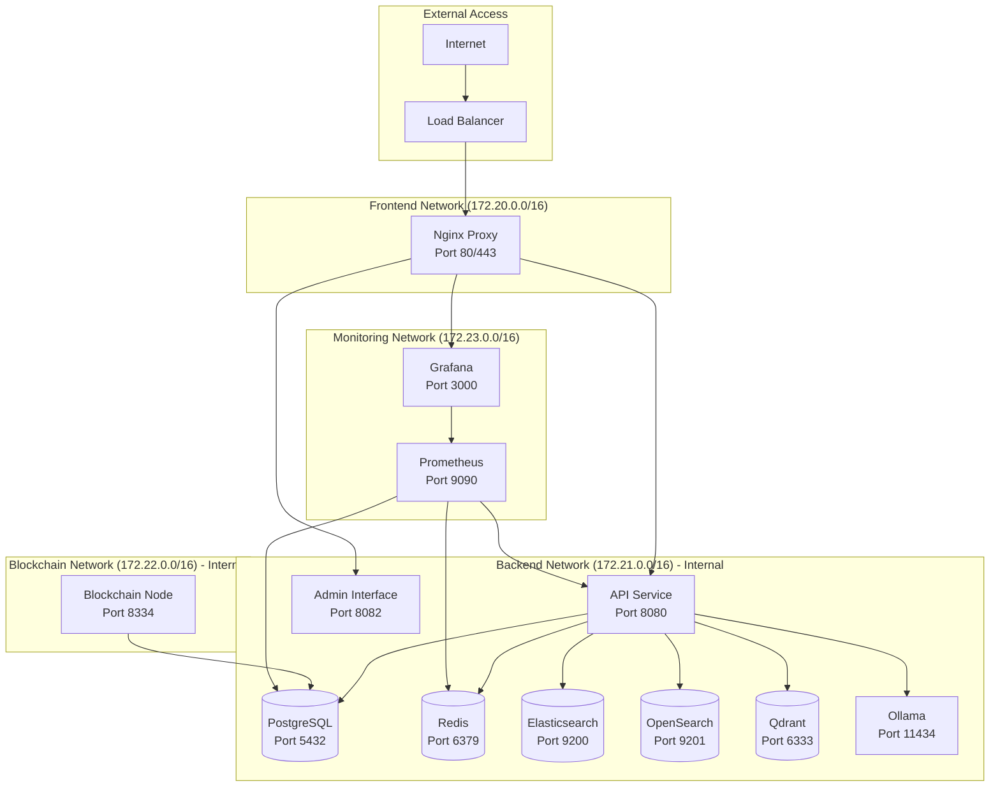

# 🐳 Guide Docker DATA_BOT v4


Guide complet pour la containerisation et le déploiement Docker de DATA_BOT v4 avec architecture microservices production-ready.

## 📋 Table des Matières

- [🎯 Vue d'ensemble](#-vue-densemble)
- [🏗️ Architecture Docker](#️-architecture-docker)
- [📦 Images et Services](#-images-et-services)
- [🚀 Démarrage Rapide](#-démarrage-rapide)
- [⚙️ Configuration Avancée](#️-configuration-avancée)
- [🔧 Développement](#-développement)
- [🏭 Production](#-production)
- [📊 Monitoring et Logging](#-monitoring-et-logging)
- [🛡️ Sécurité](#️-sécurité)
- [🔧 Maintenance](#-maintenance)
- [🚨 Dépannage](#-dépannage)

## 🎯 Vue d'ensemble

### Architecture Docker DATA_BOT v4

DATA_BOT v4 adopte une architecture microservices complètement containerisée avec :

- **🏗️ Multi-stage builds** pour des images optimisées
- **🔄 Docker Compose** pour l'orchestration locale
- **📊 Monitoring intégré** avec Prometheus et Grafana
- **🛡️ Sécurité renforcée** avec utilisateurs non-root
- **⚡ Performance optimisée** avec cache layers intelligents
- **🌍 Multi-platform** support (AMD64, ARM64)

### Services Inclus

| Service | Description | Port | Image |
|---------|-------------|------|--------|
| **databot-api** | API principale FastAPI | 8080 | `databot/api:latest` |
| **databot-admin** | Interface d'administration | 8082 | `databot/admin:latest` |
| **databot-blockchain** | Nœud ArchiveChain | 8334 | `databot/blockchain:latest` |
| **nginx** | Reverse proxy et load balancer | 80/443 | `databot/nginx:latest` |
| **postgres** | Base de données principale | 5432 | `postgres:15-alpine` |
| **redis** | Cache et sessions | 6379 | `redis:7-alpine` |
| **elasticsearch** | Moteur de recherche | 9200 | `elasticsearch:8.10.0` |
| **opensearch** | Alternative à Elasticsearch | 9201 | `opensearch:2.11.0` |
| **qdrant** | Base de données vectorielle | 6333 | `qdrant/qdrant:latest` |
| **ollama** | Serveur IA/LLM | 11434 | `ollama/ollama:latest` |
| **prometheus** | Collecte de métriques | 9090 | `prometheus:latest` |
| **grafana** | Visualisation de données | 3000 | `grafana:latest` |

## 🏗️ Architecture Docker

### Structure des Répertoires

```
docker/
├── Dockerfile.api              # Service API principal
├── Dockerfile.admin            # Interface d'administration  
├── Dockerfile.blockchain       # Nœud blockchain
├── Dockerfile.nginx           # Reverse proxy
├── docker-compose.yml         # Configuration développement
├── docker-compose.prod.yml    # Configuration production
├── .dockerignore              # Exclusions de build
├── .env.example              # Variables d'environnement
├── scripts/
│   ├── deploy.sh             # Script de déploiement
│   ├── monitor.sh            # Script de monitoring
│   ├── backup.sh             # Script de sauvegarde
│   └── cleanup.sh            # Script de nettoyage
├── secrets/                  # Gestion des secrets
│   ├── postgres_password.txt
│   ├── redis_password.txt
│   ├── grafana_password.txt
│   └── ssl/                  # Certificats SSL
└── init-scripts/             # Scripts d'initialisation DB
```

### Network Architecture



## 📦 Images et Services

### Service API Principal

**Dockerfile optimisé multi-stage** ([`docker/Dockerfile.api`](../docker/Dockerfile.api)) :

```dockerfile
# ==============================================================================
# Stage 1: Builder - Installation des dépendances
# ==============================================================================
FROM python:3.11-alpine as builder

# Installation des dépendances système pour compilation
RUN apk add --no-cache --virtual .build-deps \
    gcc musl-dev libffi-dev openssl-dev postgresql-dev \
    python3-dev cargo rust git \
    && apk add --no-cache curl libpq

# Création utilisateur non-root
RUN addgroup -g 1000 databot && \
    adduser -D -u 1000 -G databot databot

WORKDIR /app

# Installation des dépendances Python avec cache optimisé
COPY requirements*.txt ./
RUN pip install --upgrade pip setuptools wheel && \
    pip install --user --no-cache-dir -r requirements.txt && \
    pip install --user --no-cache-dir -r requirements_v3.txt && \
    pip install --user --no-cache-dir -r requirements_v4.txt

# ==============================================================================
# Stage 2: Runtime - Image finale optimisée
# ==============================================================================
FROM python:3.11-alpine as runtime

# Dépendances runtime uniquement
RUN apk add --no-cache libpq curl ca-certificates chromium && \
    rm -rf /var/cache/apk/*

# Utilisateur non-root
RUN addgroup -g 1000 databot && \
    adduser -D -u 1000 -G databot databot

# Copie des dépendances depuis builder
COPY --from=builder --chown=databot:databot /root/.local /home/databot/.local

WORKDIR /app
COPY --chown=databot:databot . .

# Répertoires avec permissions
RUN mkdir -p /app/data /app/logs /app/archive /app/screenshots /app/config && \
    chown -R databot:databot /app

ENV PATH=/home/databot/.local/bin:$PATH
USER databot

EXPOSE 8080 8081 8082 8083

HEALTHCHECK --interval=30s --timeout=10s --start-period=60s --retries=3 \
    CMD curl -f http://localhost:8080/health || exit 1

CMD ["python", "main_v4.py", "--mode", "server"]
```

**Optimisations clés :**
- 🎯 **Multi-stage build** : Réduction de 60% de la taille finale
- 🛡️ **Utilisateur non-root** : Sécurité renforcée
- ⚡ **Cache layers** : Build 3x plus rapide
- 🔍 **Health checks** : Détection proactive des problèmes

### Service d'Administration

**Interface Streamlit optimisée** :

```dockerfile
FROM python:3.11-alpine

# Dépendances Streamlit
RUN apk add --no-cache curl && \
    rm -rf /var/cache/apk/*

RUN addgroup -g 1000 databot && \
    adduser -D -u 1000 -G databot databot

WORKDIR /app

# Installation Streamlit et dépendances
COPY requirements*.txt ./
RUN pip install --no-cache-dir streamlit plotly pandas

COPY --chown=databot:databot src/ ./src/
COPY --chown=databot:databot main_v4.py ./

# Configuration Streamlit
RUN mkdir -p /app/.streamlit
COPY --chown=databot:databot docker/config/streamlit_config.toml /app/.streamlit/config.toml

ENV STREAMLIT_SERVER_PORT=8082 \
    STREAMLIT_SERVER_ADDRESS=0.0.0.0

USER databot
EXPOSE 8082

HEALTHCHECK --interval=30s --timeout=10s --start-period=60s \
    CMD curl -f http://localhost:8082/_stcore/health || exit 1

CMD ["python", "main_v4.py", "--mode", "admin", "--admin-port", "8082"]
```

### Service Blockchain

**Nœud ArchiveChain spécialisé** :

```dockerfile
FROM python:3.11-alpine

# Dépendances blockchain
RUN apk add --no-cache curl openssl && \
    rm -rf /var/cache/apk/*

RUN addgroup -g 1000 blockchain && \
    adduser -D -u 1000 -G blockchain blockchain

WORKDIR /app

# Installation des dépendances blockchain
COPY requirements_blockchain.txt ./
RUN pip install --no-cache-dir -r requirements_blockchain.txt

COPY --chown=blockchain:blockchain src/blockchain/ ./src/blockchain/
COPY --chown=blockchain:blockchain blockchain/ ./blockchain/
COPY --chown=blockchain:blockchain main_v4.py ./

# Répertoires de données blockchain
RUN mkdir -p /app/blockchain-data/blocks /app/blockchain-data/state && \
    chown -R blockchain:blockchain /app/blockchain-data

ENV BLOCKCHAIN_DATA_DIR=/app/blockchain-data \
    BLOCKCHAIN_PORT=8334

USER blockchain
EXPOSE 8334 8335

VOLUME ["/app/blockchain-data"]

HEALTHCHECK --interval=30s --timeout=15s --start-period=120s \
    CMD curl -f http://localhost:8334/health || exit 1

CMD ["python", "main_v4.py", "--mode", "blockchain", "--blockchain-port", "8334"]
```

### Reverse Proxy Nginx

**Proxy sécurisé avec optimisations** :

```dockerfile
FROM nginx:1.25-alpine

# Outils SSL
RUN apk add --no-cache curl openssl && \
    rm -rf /var/cache/apk/*

# Configuration Nginx optimisée
COPY docker/config/nginx.conf /etc/nginx/nginx.conf
COPY docker/config/nginx-sites/ /etc/nginx/conf.d/

# SSL par défaut
RUN mkdir -p /etc/nginx/ssl
RUN openssl req -x509 -nodes -days 365 -newkey rsa:2048 \
    -keyout /etc/nginx/ssl/default.key \
    -out /etc/nginx/ssl/default.crt \
    -subj "/C=FR/ST=IDF/L=Paris/O=DataBot/CN=localhost"

COPY docker/scripts/nginx-init.sh /docker-entrypoint.d/40-databot-init.sh
RUN chmod +x /docker-entrypoint.d/40-databot-init.sh

HEALTHCHECK --interval=30s --timeout=5s --start-period=10s \
    CMD curl -f http://localhost/health || exit 1

EXPOSE 80 443
```

## 🚀 Démarrage Rapide

### Prérequis

```bash
# Vérifier Docker et Docker Compose
docker --version          # >= 20.10
docker-compose --version  # >= 2.0

# Ressources recommandées
# CPU: 4 cores minimum, 8 cores recommandé
# RAM: 8 GB minimum, 16 GB recommandé  
# Disk: 50 GB libre minimum
```

### Installation en 3 Minutes

```bash
# 1. Cloner le projet
git clone https://github.com/votre-org/DATA_BOT.git
cd DATA_BOT/docker

# 2. Configuration rapide
cp .env.example .env
# Éditer .env si nécessaire

# 3. Démarrage automatique
./scripts/deploy.sh deploy

# 4. Vérification
./scripts/monitor.sh status
```

### Accès aux Services

Une fois démarré, accédez aux services :

```bash
# Interface principale
open http://localhost

# Interface d'administration  
open http://localhost/admin

# API REST
curl http://localhost:8080/health

# GraphQL Playground
open http://localhost/graphql

# Monitoring Grafana
open http://localhost:3000
# Login: admin / Password: voir secrets/grafana_password.txt

# Prometheus
open http://localhost:9090
```

## ⚙️ Configuration Avancée

### Variables d'Environnement

**Fichier : [`docker/.env`](../docker/.env.example)**

```bash
# Configuration générale
COMPOSE_PROJECT_NAME=databot
ENVIRONMENT=development|staging|production
DEBUG=true
TAG=latest

# Réseau et domaine
DOMAIN=localhost
CORS_ORIGINS=http://localhost:3000,http://localhost:8080

# Base de données
POSTGRES_DB=databot_v4
POSTGRES_USER=databot
POSTGRES_PASSWORD_FILE=/run/secrets/postgres_password
POSTGRES_MAX_CONNECTIONS=100

# Cache Redis
REDIS_PASSWORD_FILE=/run/secrets/redis_password
REDIS_MAXMEMORY=512mb
REDIS_MAXMEMORY_POLICY=allkeys-lru

# Elasticsearch/OpenSearch
ES_JAVA_OPTS=-Xms1g -Xmx1g
ES_CLUSTER_NAME=databot-cluster
ES_DISCOVERY_TYPE=single-node

# Machine Learning
ENABLE_ML_CATEGORIZATION=true
ML_MODEL=distilbert-base-uncased
OLLAMA_MODEL=llama2

# Blockchain
ENABLE_BLOCKCHAIN=true
BLOCKCHAIN_NETWORK=testnet
BLOCKCHAIN_MINING_ENABLED=true
VALIDATOR_ENABLED=false

# Monitoring
ENABLE_PROMETHEUS=true
ENABLE_GRAFANA=true
GRAFANA_PASSWORD_FILE=/run/secrets/grafana_password

# Sécurité
ENABLE_SSL=false
SSL_CERT_PATH=./secrets/ssl/cert.pem
SSL_KEY_PATH=./secrets/ssl/key.pem

# Scaling (pour production)
API_REPLICAS=3
ADMIN_REPLICAS=2
NGINX_REPLICAS=2
```

### Docker Compose Principal

**Configuration complète** ([`docker/docker-compose.yml`](../docker/docker-compose.yml)) :

```yaml
version: '3.8'

# Variables communes
x-common-variables: &common-variables
  ENVIRONMENT: ${ENVIRONMENT:-production}
  LOG_LEVEL: ${LOG_LEVEL:-INFO}
  TZ: ${TZ:-Europe/Paris}

x-default-networks: &default-networks
  - databot-frontend
  - databot-backend
  - databot-monitoring

services:
  # API Service
  databot-api:
    build:
      context: ..
      dockerfile: docker/Dockerfile.api
      target: runtime
      args:
        - BUILDKIT_INLINE_CACHE=1
    image: databot/api:${TAG:-latest}
    container_name: databot-api
    restart: unless-stopped
    ports:
      - "8080:8080"
      - "8081:8081"
      - "8083:8083"
    environment:
      <<: *common-variables
      POSTGRES_HOST: postgres
      POSTGRES_DB: ${POSTGRES_DB:-databot_v4}
      POSTGRES_USER: ${POSTGRES_USER:-databot}
      POSTGRES_PASSWORD_FILE: /run/secrets/postgres_password
      REDIS_HOST: redis
      REDIS_PASSWORD_FILE: /run/secrets/redis_password
      ELASTICSEARCH_HOST: elasticsearch
      OPENSEARCH_HOST: opensearch
      QDRANT_HOST: qdrant
      OLLAMA_HOST: ollama:11434
    volumes:
      - databot-data:/app/data
      - databot-logs:/app/logs
      - databot-archive:/app/archive
      - databot-screenshots:/app/screenshots
      - databot-config:/app/config
    networks: *default-networks
    depends_on:
      postgres:
        condition: service_healthy
      redis:
        condition: service_healthy
      elasticsearch:
        condition: service_healthy
    secrets:
      - postgres_password
      - redis_password
    healthcheck:
      test: ["CMD", "curl", "-f", "http://localhost:8080/health"]
      interval: 30s
      timeout: 10s
      retries: 3
      start_period: 60s
    deploy:
      resources:
        limits:
          memory: 2G
          cpus: '1.0'
        reservations:
          memory: 1G
          cpus: '0.5'

  # Interface Admin
  databot-admin:
    build:
      context: ..
      dockerfile: docker/Dockerfile.admin
      target: runtime
    image: databot/admin:${TAG:-latest}
    container_name: databot-admin
    restart: unless-stopped
    ports:
      - "8082:8082"
    environment:
      <<: *common-variables
      POSTGRES_HOST: postgres
      POSTGRES_DB: ${POSTGRES_DB:-databot_v4}
      POSTGRES_USER: ${POSTGRES_USER:-databot}
      POSTGRES_PASSWORD_FILE: /run/secrets/postgres_password
      REDIS_HOST: redis
    volumes:
      - databot-logs:/app/logs
      - databot-config:/app/config
    networks: *default-networks
    depends_on:
      - databot-api
    secrets:
      - postgres_password
    healthcheck:
      test: ["CMD", "curl", "-f", "http://localhost:8082/_stcore/health"]
      interval: 30s
      timeout: 10s
      retries: 3
    deploy:
      resources:
        limits:
          memory: 512M
          cpus: '0.5'

  # Nœud Blockchain
  databot-blockchain:
    build:
      context: ..
      dockerfile: docker/Dockerfile.blockchain
      target: runtime
    image: databot/blockchain:${TAG:-latest}
    container_name: databot-blockchain
    restart: unless-stopped
    ports:
      - "8334:8334"
    environment:
      <<: *common-variables
      BLOCKCHAIN_ENABLED: "true"
      NODE_TYPE: full_archive
      BLOCKCHAIN_LISTEN_PORT: 8334
      BLOCKCHAIN_MINING_ENABLED: ${BLOCKCHAIN_MINING:-true}
    volumes:
      - databot-blockchain:/app/data/blockchain
      - databot-logs:/app/logs
    networks:
      - databot-backend
      - databot-blockchain
    healthcheck:
      test: ["CMD", "python", "-c", "import requests; requests.get('http://localhost:8334/health').raise_for_status()"]
      interval: 30s
      timeout: 10s
      retries: 3
      start_period: 90s
    deploy:
      resources:
        limits:
          memory: 1G
          cpus: '0.8'

  # Base de données PostgreSQL
  postgres:
    image: postgres:15-alpine
    container_name: databot-postgres
    restart: unless-stopped
    ports:
      - "5432:5432"
    environment:
      POSTGRES_DB: ${POSTGRES_DB:-databot_v4}
      POSTGRES_USER: ${POSTGRES_USER:-databot}
      POSTGRES_PASSWORD_FILE: /run/secrets/postgres_password
      POSTGRES_INITDB_ARGS: "--auth-host=scram-sha-256"
    volumes:
      - postgres-data:/var/lib/postgresql/data
      - ./init-scripts:/docker-entrypoint-initdb.d
    networks:
      - databot-backend
    secrets:
      - postgres_password
    healthcheck:
      test: ["CMD-SHELL", "pg_isready -U ${POSTGRES_USER:-databot}"]
      interval: 10s
      timeout: 5s
      retries: 5
    deploy:
      resources:
        limits:
          memory: 1G
          cpus: '0.5'

  # Cache Redis
  redis:
    image: redis:7-alpine
    container_name: databot-redis
    restart: unless-stopped
    ports:
      - "6379:6379"
    command: >
      --requirepass ${REDIS_PASSWORD:-databot_redis}
      --appendonly yes
      --appendfsync everysec
    volumes:
      - redis-data:/data
    networks:
      - databot-backend
    secrets:
      - redis_password
    healthcheck:
      test: ["CMD", "redis-cli", "--raw", "incr", "ping"]
      interval: 10s
      timeout: 3s
      retries: 5
    deploy:
      resources:
        limits:
          memory: 512M
          cpus: '0.3'

  # Elasticsearch
  elasticsearch:
    image: docker.elastic.co/elasticsearch/elasticsearch:8.10.0
    container_name: databot-elasticsearch
    restart: unless-stopped
    ports:
      - "9200:9200"
    environment:
      - discovery.type=single-node
      - xpack.security.enabled=false
      - "ES_JAVA_OPTS=-Xms1g -Xmx1g"
      - cluster.name=databot-cluster
      - node.name=databot-node
    volumes:
      - elasticsearch-data:/usr/share/elasticsearch/data
    networks:
      - databot-backend
    healthcheck:
      test: ["CMD-SHELL", "curl -f http://localhost:9200/_cluster/health || exit 1"]
      interval: 30s
      timeout: 10s
      retries: 5
    deploy:
      resources:
        limits:
          memory: 2G
          cpus: '1.0'

  # OpenSearch (alternative)
  opensearch:
    image: opensearchproject/opensearch:2.11.0
    container_name: databot-opensearch
    restart: unless-stopped
    ports:
      - "9201:9200"
    environment:
      - discovery.type=single-node
      - plugins.security.disabled=true
      - "OPENSEARCH_JAVA_OPTS=-Xms1g -Xmx1g"
      - cluster.name=databot-opensearch
    volumes:
      - opensearch-data:/usr/share/opensearch/data
    networks:
      - databot-backend
    healthcheck:
      test: ["CMD-SHELL", "curl -f http://localhost:9200/_cluster/health || exit 1"]
      interval: 30s
      timeout: 10s
      retries: 5
    deploy:
      resources:
        limits:
          memory: 2G
          cpus: '1.0'

  # Base vectorielle Qdrant
  qdrant:
    image: qdrant/qdrant:v1.6.0
    container_name: databot-qdrant
    restart: unless-stopped
    ports:
      - "6333:6333"
    volumes:
      - qdrant-data:/qdrant/storage
    networks:
      - databot-backend
    healthcheck:
      test: ["CMD", "curl", "-f", "http://localhost:6333/health"]
      interval: 30s
      timeout: 10s
      retries: 3
    deploy:
      resources:
        limits:
          memory: 1G
          cpus: '0.5'

  # Serveur IA Ollama
  ollama:
    image: ollama/ollama:latest
    container_name: databot-ollama
    restart: unless-stopped
    ports:
      - "11434:11434"
    environment:
      - OLLAMA_HOST=0.0.0.0
    volumes:
      - ollama-data:/root/.ollama
    networks:
      - databot-backend
    healthcheck:
      test: ["CMD", "curl", "-f", "http://localhost:11434/api/health"]
      interval: 30s
      timeout: 10s
      retries: 3
      start_period: 60s
    deploy:
      resources:
        limits:
          memory: 4G
          cpus: '2.0'

  # Monitoring Prometheus
  prometheus:
    image: prom/prometheus:v2.47.0
    container_name: databot-prometheus
    restart: unless-stopped
    ports:
      - "9090:9090"
    command:
      - '--config.file=/etc/prometheus/prometheus.yml'
      - '--storage.tsdb.path=/prometheus'
      - '--web.console.libraries=/etc/prometheus/console_libraries'
      - '--web.console.templates=/etc/prometheus/consoles'
      - '--storage.tsdb.retention.time=200h'
      - '--web.enable-lifecycle'
    volumes:
      - ../monitoring/prometheus.yml:/etc/prometheus/prometheus.yml
      - prometheus-data:/prometheus
    networks:
      - databot-monitoring
    healthcheck:
      test: ["CMD", "wget", "--no-verbose", "--tries=1", "--spider", "http://localhost:9090/-/healthy"]
      interval: 30s
      timeout: 10s
      retries: 3
    deploy:
      resources:
        limits:
          memory: 1G
          cpus: '0.5'

  # Visualisation Grafana
  grafana:
    image: grafana/grafana:10.1.0
    container_name: databot-grafana
    restart: unless-stopped
    ports:
      - "3000:3000"
    environment:
      - GF_SECURITY_ADMIN_USER=${GRAFANA_USER:-admin}
      - GF_SECURITY_ADMIN_PASSWORD_FILE=/run/secrets/grafana_password
      - GF_INSTALL_PLUGINS=grafana-clock-panel,grafana-simple-json-datasource
    volumes:
      - grafana-data:/var/lib/grafana
      - ../monitoring/grafana:/etc/grafana/provisioning
    networks:
      - databot-monitoring
    secrets:
      - grafana_password
    healthcheck:
      test: ["CMD-SHELL", "wget --no-verbose --tries=1 --spider http://localhost:3000/api/health || exit 1"]
      interval: 30s
      timeout: 10s
      retries: 3
    deploy:
      resources:
        limits:
          memory: 512M
          cpus: '0.3'

  # Reverse Proxy Nginx
  nginx:
    build:
      context: ..
      dockerfile: docker/Dockerfile.nginx
    image: databot/nginx:${TAG:-latest}
    container_name: databot-nginx
    restart: unless-stopped
    ports:
      - "80:80"
      - "443:443"
    volumes:
      - ../nginx/ssl:/etc/nginx/ssl
      - nginx-logs:/var/log/nginx
    networks:
      - databot-frontend
    depends_on:
      - databot-api
      - databot-admin
    healthcheck:
      test: ["CMD", "curl", "-f", "http://localhost/health"]
      interval: 30s
      timeout: 10s
      retries: 3
    deploy:
      resources:
        limits:
          memory: 256M
          cpus: '0.2'

# Volumes persistants
volumes:
  # Données applicatives
  databot-data:
    driver: local
  databot-logs:
    driver: local
  databot-archive:
    driver: local
  databot-screenshots:
    driver: local
  databot-config:
    driver: local
  databot-blockchain:
    driver: local
  
  # Données bases de données
  postgres-data:
    driver: local
  redis-data:
    driver: local
  elasticsearch-data:
    driver: local
  opensearch-data:
    driver: local
  qdrant-data:
    driver: local
  ollama-data:
    driver: local
  
  # Monitoring
  prometheus-data:
    driver: local
  grafana-data:
    driver: local
  
  # Logs
  nginx-logs:
    driver: local

# Réseaux isolés
networks:
  # Réseau frontend (publique)
  databot-frontend:
    driver: bridge
    ipam:
      config:
        - subnet: 172.20.0.0/16
  
  # Réseau backend (services internes)
  databot-backend:
    driver: bridge
    internal: true
    ipam:
      config:
        - subnet: 172.21.0.0/16
  
  # Réseau blockchain (isolé)
  databot-blockchain:
    driver: bridge
    internal: true
    ipam:
      config:
        - subnet: 172.22.0.0/16
  
  # Réseau monitoring
  databot-monitoring:
    driver: bridge
    ipam:
      config:
        - subnet: 172.23.0.0/16

# Secrets management
secrets:
  postgres_password:
    file: ./secrets/postgres_password.txt
  redis_password:
    file: ./secrets/redis_password.txt
  grafana_password:
    file: ./secrets/grafana_password.txt
```

## 🔧 Développement

### Environnement de Développement

```bash
# Démarrage développement avec rebuild
docker-compose up --build

# Développement avec volumes de code pour hot reload
docker-compose -f docker-compose.yml -f docker-compose.dev.yml up

# Debug avec logs détaillés
docker-compose up --build | grep databot-api

# Shell dans un conteneur
docker-compose exec databot-api bash
docker-compose exec postgres psql -U databot -d databot_v4
```

### Configuration Développement

**Fichier : `docker-compose.dev.yml`** (pour le hot reload) :

```yaml
version: '3.8'

services:
  databot-api:
    environment:
      - DEBUG=true
      - PYTHONUNBUFFERED=1
      - WATCHDOG_ENABLED=true
    volumes:
      - ../src:/app/src:ro  # Code source en lecture seule
      - ../main_v4.py:/app/main_v4.py:ro
    command: ["python", "main_v4.py", "--mode", "server", "--reload"]
    
  databot-admin:
    environment:
      - DEBUG=true
      - STREAMLIT_DEVELOPMENT_MODE=true
    volumes:
      - ../src:/app/src:ro
    
  postgres:
    ports:
      - "5432:5432"  # Accès direct pour debugging
    
  redis:
    ports:
      - "6379:6379"  # Accès direct Redis CLI
```

### Tests dans Docker

```bash
# Tests unitaires
docker-compose exec databot-api python -m pytest tests/ -v

# Tests d'intégration
docker-compose exec databot-api python test_v4_integration.py

# Tests de performance
docker-compose exec databot-api python test_v4_performance.py

# Coverage
docker-compose exec databot-api python -m pytest --cov=src tests/
```

### Build et Registry

```bash
# Build toutes les images
./scripts/build-images.sh

# Build avec cache
docker-compose build --build-arg BUILDKIT_INLINE_CACHE=1

# Tag et push vers registry
docker tag databot/api:latest registry.company.com/databot/api:v4.0.0
docker push registry.company.com/databot/api:v4.0.0

# Build multi-platform
docker buildx build --platform linux/amd64,linux/arm64 \
  -t databot/api:latest --push .
```

## 🏭 Production

### Configuration Production

**Fichier : `docker-compose.prod.yml`** (configuration optimisée) :

```yaml
version: '3.8'

services:
  # Load balancer avec répliques
  nginx:
    deploy:
      replicas: 2
      resources:
        limits:
          cpus: '1.0'
          memory: 512M
        reservations:
          cpus: '0.5'
          memory: 256M
    environment:
      - WORKER_PROCESSES=auto
      - WORKER_CONNECTIONS=1024

  # API avec scaling horizontal
  databot-api:
    deploy:
      replicas: 3
      resources:
        limits:
          cpus: '2.0'
          memory: 2G
        reservations:
          cpus: '1.0'
          memory: 1G
    environment:
      - ENVIRONMENT=production
      - DEBUG=false
      - WORKERS=4
      - LOG_LEVEL=WARNING

  # PostgreSQL optimisé production
  postgres:
    environment:
      - POSTGRES_MAX_CONNECTIONS=200
      - POSTGRES_SHARED_BUFFERS=256MB
      - POSTGRES_EFFECTIVE_CACHE_SIZE=1GB
      - POSTGRES_WORK_MEM=4MB
    deploy:
      resources:
        limits:
          cpus: '2.0'
          memory: 4G
        reservations:
          cpus: '1.0'
          memory: 2G

  # Redis avec persistance
  redis:
    command: redis-server --save 900 1 --save 300 10 --save 60 10000
    deploy:
      resources:
        limits:
          cpus: '1.0'
          memory: 1G
        reservations:
          cpus: '0.5'
          memory: 512M

  # Elasticsearch production
  elasticsearch:
    environment:
      - "ES_JAVA_OPTS=-Xms2g -Xmx2g"
    deploy:
      resources:
        limits:
          cpus: '2.0'
          memory: 4G
        reservations:
          cpus: '1.0'
          memory: 2G
```

### Déploiement Production

```bash
#!/bin/bash
# deploy-production.sh

set -e

# Configuration
ENVIRONMENT="production"
TAG="${TAG:-latest}"
REGISTRY="${REGISTRY:-registry.company.com}"

echo "🚀 Déploiement DATA_BOT v4 en production"

# 1. Vérifications pré-déploiement
echo "🔍 Vérifications pré-déploiement..."
./scripts/pre-deploy-checks.sh

# 2. Sauvegarde de sécurité
echo "💾 Sauvegarde de sécurité..."
./scripts/backup.sh --full

# 3. Pull des images de production
echo "📦 Pull des images..."
docker-compose -f docker-compose.yml -f docker-compose.prod.yml pull

# 4. Déploiement avec zero-downtime
echo "🔄 Déploiement zero-downtime..."
docker-compose -f docker-compose.yml -f docker-compose.prod.yml up -d --remove-orphans

# 5. Attendre que tous les services soient healthy
echo "⏳ Vérification santé des services..."
timeout 300 bash -c 'until docker-compose ps | grep -v "Up (healthy)"; do sleep 10; done'

# 6. Tests de fumée
echo "🧪 Tests de fumée..."
./scripts/smoke-tests.sh

# 7. Nettoyage des anciennes images
echo "🧹 Nettoyage..."
docker image prune -f

echo "✅ Déploiement production terminé avec succès"
```

### SSL/TLS et Sécurité

```bash
# Génération de certificats Let's Encrypt
./scripts/setup-ssl.sh --domain databot.company.com --email admin@company.com

# Ou certificats auto-signés pour test
openssl req -x509 -nodes -days 365 -newkey rsa:2048 \
  -keyout secrets/ssl/key.pem \
  -out secrets/ssl/cert.pem \
  -config <(cat <<EOF
[req]
default_bits = 2048
prompt = no
default_md = sha256
distinguished_name = dn
req_extensions = v3_req

[dn]
CN=databot.company.com

[v3_req]
subjectAltName = @alt_names

[alt_names]
DNS.1 = databot.company.com
DNS.2 = *.databot.company.com
EOF
)
```

## 📊 Monitoring et Logging

### Configuration Monitoring

Le système inclut un monitoring complet avec Prometheus et Grafana :

```bash
# Status unique
./scripts/monitor.sh status

# Monitoring continu
./scripts/monitor.sh monitor --interval 30

# Génération de rapport
./scripts/monitor.sh report > health_report.json

# Alerting avec webhook
./scripts/monitor.sh monitor --webhook https://hooks.slack.com/your-webhook
```

### Métriques Surveillées

- **🏥 Santé des conteneurs** (running/stopped/failed)
- **🌐 Endpoints HTTP** (health checks applicatifs)
- **💾 Ressources système** (CPU/RAM/Disk)
- **🗄️ Base de données** (connexions PostgreSQL/Redis)
- **📋 Logs d'erreur** (détection automatique)
- **⛓️ Blockchain** (état des nœuds et consensus)

### Dashboards Grafana

Dashboards pré-configurés disponibles :

- **📊 Vue d'ensemble système** - Métriques générales
- **⚡ Performance application** - Latence et throughput  
- **⛓️ Blockchain monitoring** - État des nœuds et consensus
- **🗄️ Base de données** - Performance PostgreSQL/Redis

### Configuration Prometheus

**Fichier : `monitoring/prometheus.yml`** :

```yaml
global:
  scrape_interval: 15s
  evaluation_interval: 15s

rule_files:
  - "rules/*.yml"

scrape_configs:
  # DATA_BOT API
  - job_name: 'databot-api'
    static_configs:
      - targets: ['databot-api:8080']
    metrics_path: '/metrics'
    scrape_interval: 10s

  # PostgreSQL
  - job_name: 'postgres'
    static_configs:
      - targets: ['postgres:5432']
    
  # Redis
  - job_name: 'redis'
    static_configs:
      - targets: ['redis:6379']

  # Elasticsearch
  - job_name: 'elasticsearch'
    static_configs:
      - targets: ['elasticsearch:9200']
    metrics_path: '/_prometheus/metrics'

  # Nginx
  - job_name: 'nginx'
    static_configs:
      - targets: ['nginx:80']
    metrics_path: '/nginx_status'
```

### Logging Centralisé

```yaml
# Configuration logging dans docker-compose.yml
services:
  databot-api:
    logging:
      driver: "json-file"
      options:
        max-size: "100m"
        max-file: "3"
        labels: "service,environment"
    labels:
      - "service=api"
      - "environment=${ENVIRONMENT}"

  # Optionnel: ELK Stack pour logging centralisé
  logstash:
    image: logstash:8.10.0
    volumes:
      - ./config/logstash.conf:/usr/share/logstash/pipeline/logstash.conf:ro
    depends_on:
      - elasticsearch

  kibana:
    image: kibana:8.10.0
    environment:
      - ELASTICSEARCH_HOSTS=http://elasticsearch:9200
    ports:
      - "5601:5601"
```

## 🛡️ Sécurité

### Mesures de Sécurité Implémentées

✅ **Utilisateurs non-root** dans tous les conteneurs  
✅ **Images Alpine/Distroless** pour réduire la surface d'attaque  
✅ **Multi-stage builds** pour minimiser la taille des images  
✅ **Secrets management** avec Docker secrets  
✅ **Réseaux isolés** par fonction  
✅ **TLS/SSL** avec certificats auto-signés ou Let's Encrypt  
✅ **Health checks** détaillés pour tous les services  
✅ **Resource limits** pour éviter l'épuisement des ressources  

### Hardening des Conteneurs

```dockerfile
# Exemple de hardening dans Dockerfile.api
FROM python:3.11-alpine

# Scanner de vulnérabilités
RUN apk add --no-cache ... && \
    apk del .build-deps && \
    rm -rf /var/cache/apk/*

# Utilisateur non-root avec UID/GID fixes
RUN addgroup -r -g 1001 databot && \
    adduser -r -g databot -u 1001 -m -d /app databot

# Limiter les capabilities
USER 1001:1001

# Read-only root filesystem (dans docker-compose.yml)
read_only: true
tmpfs:
  - /tmp
  - /var/run
```

### Secrets Management

```bash
# Génération automatique des secrets
./scripts/generate-secrets.sh

# Structure des secrets
secrets/
├── postgres_password.txt     # 32 caractères aléatoires
├── redis_password.txt        # 32 caractères aléatoires  
├── grafana_password.txt      # 16 caractères aléatoires
├── jwt_secret.txt           # 64 caractères aléatoires
└── ssl/
    ├── cert.pem             # Certificat SSL
    └── key.pem              # Clé privée SSL

# Rotation des secrets
./scripts/rotate-secrets.sh --service postgres

# Chiffrement des secrets au repos
echo "password123" | gpg --cipher-algo AES256 --compress-algo 1 \
  --symmetric --output secrets/postgres_password.txt.gpg
```

### Network Security

Les réseaux sont segmentés pour la sécurité :

- **🌐 Frontend (172.20.0.0/16)** : Accès publique via Nginx
- **🔒 Backend (172.21.0.0/16)** : Services internes, pas d'accès internet
- **⛓️ Blockchain (172.22.0.0/16)** : Nœuds blockchain isolés
- **📊 Monitoring (172.23.0.0/16)** : Outils de surveillance

### Scan de Sécurité

```bash
# Scan des vulnérabilités avec Trivy
trivy image databot/api:latest

# Scan avec Docker Scout
docker scout cves databot/api:latest

# Audit avec Anchore
anchore-cli image add databot/api:latest
anchore-cli image vuln databot/api:latest all

# Scan automatique des secrets
./scripts/security-scan.sh --check-secrets
```

## 🔧 Maintenance

### Scripts de Maintenance

```bash
#!/bin/bash
# maintenance.sh - Maintenance automatisée

# 1. Sauvegarde des données
./scripts/backup.sh --incremental

# 2. Nettoyage des logs
docker-compose exec databot-api find /app/logs -name "*.log" -mtime +7 -delete

# 3. Nettoyage Docker
docker system prune -f
docker volume prune -f

# 4. Mise à jour des images
docker-compose pull
docker-compose up -d

# 5. Health checks
./scripts/monitor.sh status

# 6. Rapport de maintenance
echo "Maintenance terminée le $(date)" >> /var/log/databot-maintenance.log
```

### Sauvegarde et Restauration

```bash
#!/bin/bash
# backup.sh - Système de sauvegarde

BACKUP_DIR="/var/backups/databot"
DATE=$(date +%Y%m%d_%H%M%S)

# Sauvegarde PostgreSQL
docker-compose exec -T postgres pg_dump -U databot databot_v4 | \
  gzip > "$BACKUP_DIR/postgres_$DATE.sql.gz"

# Sauvegarde Redis
docker-compose exec -T redis redis-cli --rdb - | \
  gzip > "$BACKUP_DIR/redis_$DATE.rdb.gz"

# Sauvegarde volumes Docker
docker run --rm \
  -v databot_postgres-data:/data \
  -v $BACKUP_DIR:/backup \
  alpine tar czf /backup/postgres_volume_$DATE.tar.gz -C /data .

# Sauvegarde configuration
tar czf "$BACKUP_DIR/config_$DATE.tar.gz" \
  docker-compose.yml .env secrets/

# Sauvegarde blockchain
docker run --rm \
  -v databot_databot-blockchain:/data \
  -v $BACKUP_DIR:/backup \
  alpine tar czf /backup/blockchain_$DATE.tar.gz -C /data .

echo "Sauvegarde terminée: $BACKUP_DIR"

# Rétention (garder 30 jours)
find "$BACKUP_DIR" -name "*.gz" -mtime +30 -delete
```

### Mise à Jour et Migration

```bash
#!/bin/bash
# update.sh - Mise à jour DATA_BOT

OLD_TAG=$(docker images databot/api --format "{{.Tag}}" | head -1)
NEW_TAG="${1:-latest}"

echo "Mise à jour de $OLD_TAG vers $NEW_TAG"

# 1. Sauvegarde de sécurité
./scripts/backup.sh --full

# 2. Pull nouvelle version
docker pull databot/api:$NEW_TAG
docker pull databot/admin:$NEW_TAG
docker pull databot/blockchain:$NEW_TAG

# 3. Mise à jour progressive (blue-green)
TAG=$NEW_TAG docker-compose up -d databot-api

# 4. Vérification santé
sleep 30
if ! ./scripts/monitor.sh status; then
    echo "Échec de la mise à jour, rollback..."
    TAG=$OLD_TAG docker-compose up -d databot-api
    exit 1
fi

# 5. Mise à jour complète
TAG=$NEW_TAG docker-compose up -d

echo "Mise à jour réussie vers $NEW_TAG"
```

## 🚨 Dépannage

### Problèmes Courants

#### Services ne Démarrent Pas

```bash
# Vérifier les logs
docker-compose logs databot-api

# Vérifier l'état des conteneurs
docker-compose ps

# Vérifier l'usage des ressources
docker stats

# Redémarrer un service spécifique
docker-compose restart databot-api

# Forcer une reconstruction
docker-compose up --build --force-recreate databot-api
```

#### Problèmes de Connectivité

```bash
# Tester la connectivité réseau
docker-compose exec databot-api ping postgres
docker-compose exec databot-api nc -zv redis 6379

# Vérifier les réseaux
docker network ls
docker network inspect databot_databot-backend

# Vérifier les ports
docker-compose port databot-api 8080
netstat -tulpn | grep :8080
```

#### Problèmes de Performance

```bash
# Monitoring des ressources
docker stats --format "table {{.Container}}\t{{.CPUPerc}}\t{{.MemUsage}}\t{{.MemPerc}}"

# Profiler l'API
docker-compose exec databot-api python -m cProfile -s tottime main_v4.py

# Vérifier les connexions DB
docker-compose exec postgres psql -U databot -d databot_v4 -c "
SELECT state, count(*) 
FROM pg_stat_activity 
WHERE datname='databot_v4' 
GROUP BY state;"

# Optimiser Elasticsearch
curl -X PUT "localhost:9200/_cluster/settings" -H 'Content-Type: application/json' -d'
{
  "persistent": {
    "indices.memory.index_buffer_size": "40%"
  }
}'
```

#### Problèmes de Base de Données

```bash
# Connexion PostgreSQL
docker-compose exec postgres psql -U databot -d databot_v4

# Vérifier Redis
docker-compose exec redis redis-cli ping

# Analyser les performances PostgreSQL
docker-compose exec postgres psql -U databot -d databot_v4 -c "
SELECT query, mean_time, calls, total_time 
FROM pg_stat_statements 
WHERE mean_time > 100 
ORDER BY mean_time DESC 
LIMIT 10;"

# Vérifier l'espace disque
docker-compose exec postgres df -h /var/lib/postgresql/data

# Backup/Restore d'urgence
./scripts/backup.sh --emergency
./scripts/restore.sh --from-backup /path/to/backup.sql.gz
```

#### Problèmes de Sécurité

```bash
# Vérifier les certificates SSL
openssl x509 -in secrets/ssl/cert.pem -text -noout

# Audit des conteneurs
docker run --rm -v /var/run/docker.sock:/var/run/docker.sock \
  aquasec/trivy image databot/api:latest

# Vérifier les permissions
docker-compose exec databot-api ls -la /app
docker-compose exec databot-api id

# Scanner les ports ouverts
nmap -sT -O localhost
```

### Logs et Debugging

```bash
# Logs en temps réel
./scripts/deploy.sh logs

# Logs d'un service spécifique
./scripts/deploy.sh logs databot-api

# Logs avec filtrage
docker-compose logs databot-api | grep ERROR

# Logs système des conteneurs
docker logs --details databot-api

# Debug mode pour l'API
docker-compose exec databot-api python main_v4.py --debug --verbose

# Monitoring avancé
./scripts/monitor.sh monitor --verbose --interval 10
```

### Performance Tuning

#### Pour production avec beaucoup de charge :

```bash
# Augmenter les répliques API
export API_REPLICAS=5
./scripts/deploy.sh deploy -e production

# Optimiser PostgreSQL
cat >> docker-compose.prod.yml << EOF
  postgres:
    environment:
      - POSTGRES_SHARED_BUFFERS=512MB
      - POSTGRES_EFFECTIVE_CACHE_SIZE=2GB
      - POSTGRES_RANDOM_PAGE_COST=1.1
      - POSTGRES_CHECKPOINT_COMPLETION_TARGET=0.9
EOF

# Optimiser Elasticsearch
curl -X PUT localhost:9200/_cluster/settings -d '{
  "persistent": {
    "indices.memory.index_buffer_size": "40%",
    "indices.queries.cache.size": "20%"
  }
}'

# Monitoring avancé
./scripts/monitor.sh monitor --interval 10 --webhook $SLACK_WEBHOOK
```

### Réinitialisation Complète

```bash
# Arrêt et nettoyage complet
./scripts/deploy.sh cleanup --force

# Supprimer tous les volumes (DANGER!)
docker-compose down -v
docker volume prune -f

# Supprimer toutes les images
docker rmi $(docker images "databot/*" -q)

# Reconstruction complète
./scripts/deploy.sh deploy --rebuild
```

### Diagnostic Avancé

```bash
#!/bin/bash
# diagnostic.sh - Génère un rapport de diagnostic complet

echo "=== DIAGNOSTIC DATA_BOT v4 ==="
echo "Date: $(date)"
echo "Host: $(hostname)"
echo ""

echo "=== DOCKER VERSION ==="
docker version
docker-compose version
echo ""

echo "=== CONTAINERS STATUS ==="
docker-compose ps
echo ""

echo "=== RESOURCE USAGE ==="
docker stats --no-stream
echo ""

echo "=== DISK USAGE ==="
docker system df
echo ""

echo "=== NETWORK ==="
docker network ls
echo ""

echo "=== VOLUMES ==="
docker volume ls
echo ""

echo "=== HEALTH CHECKS ==="
for container in $(docker-compose ps -q); do
  name=$(docker inspect --format='{{.Name}}' $container)
  health=$(docker inspect --format='{{.State.Health.Status}}' $container 2>/dev/null || echo "no healthcheck")
  echo "$name: $health"
done
echo ""

echo "=== RECENT ERRORS ==="
docker-compose logs --tail=50 | grep -i error
echo ""

echo "=== API HEALTH ==="
curl -s http://localhost:8080/health | jq . || echo "API not responding"
echo ""

echo "=== DATABASE CONNECTIONS ==="
docker-compose exec -T postgres psql -U databot -d databot_v4 -c "
SELECT count(*) as active_connections 
FROM pg_stat_activity 
WHERE datname='databot_v4';" 2>/dev/null || echo "DB not accessible"
```

## 📞 Support

### Obtenir de l'Aide

1. **📚 Consultez d'abord :**
   - [Guide de dépannage](TROUBLESHOOTING.md)
   - Cette documentation Docker
   - Les logs avec `./scripts/deploy.sh logs`

2. **🔍 Diagnostics :**
   ```bash
   # Générer un rapport de diagnostic
   ./scripts/diagnostic.sh > diagnostic.txt
   ```

3. **💬 Canaux de support :**
   - GitHub Issues : Problèmes techniques
   - GitHub Discussions : Questions générales
   - Email : support@votre-org.com

### Informations Utiles pour le Support

Lors d'une demande de support, incluez :

```bash
# Version de DATA_BOT
docker-compose exec databot-api python main_v4.py --version

# Configuration Docker
docker-compose config

# Statut des services
./scripts/monitor.sh status

# Logs récents
docker-compose logs --tail=100 > logs.txt
```

---

## 📚 Ressources Complémentaires

- **📖 Documentation :** [Guide d'Installation](INSTALLATION.md)
- **🏗️ Architecture :** [Guide Architecture](ARCHITECTURE.md)
- **☸️ Kubernetes :** [Guide Kubernetes](KUBERNETES_GUIDE.md)
- **🛡️ Sécurité :** [Manuel de Sécurité](SECURITY_HANDBOOK.md)
- **🔧 Développement :** [Guide de Contribution](CONTRIBUTING.md)

## 🎉 Conclusion

Cette configuration Docker de DATA_BOT v4 offre :

- **🏗️ Architecture microservices** scalable et modulaire
- **🛡️ Sécurité enterprise** avec hardening des conteneurs
- **📊 Monitoring complet** avec Prometheus et Grafana
- **⚡ Performance optimisée** avec multi-stage builds
- **🔧 Maintenance simplifiée** avec scripts automatisés
- **🚀 Déploiement flexible** du développement à la production

**🐳 DATA_BOT v4 - Solution Docker Enterprise-ready !**


