# ☸️ Guide Kubernetes DATA_BOT v4


Guide complet pour le déploiement et la gestion de DATA_BOT v4 sur Kubernetes avec haute disponibilité, autoscaling et monitoring intégré.

## 📋 Table des Matières

- [🎯 Vue d'ensemble](#-vue-densemble)
- [🏗️ Architecture Kubernetes](#️-architecture-kubernetes)
- [📦 Ressources Kubernetes](#-ressources-kubernetes)
- [🚀 Déploiement](#-déploiement)
- [⚙️ Configuration](#️-configuration)
- [📊 Monitoring et Observabilité](#-monitoring-et-observabilité)
- [🔒 Sécurité](#-sécurité)
- [📈 Scaling et Performances](#-scaling-et-performances)
- [🔧 Maintenance](#-maintenance)
- [🚨 Dépannage](#-dépannage)

## 🎯 Vue d'ensemble

### Architecture Cloud-Native

DATA_BOT v4 sur Kubernetes offre une architecture cloud-native complète avec :

- **☸️ Orchestration native** avec haute disponibilité
- **📈 Auto-scaling** horizontal et vertical
- **🔄 Rolling updates** sans interruption de service
- **🛡️ Sécurité renforcée** avec RBAC et Pod Security Standards
- **📊 Monitoring complet** avec Prometheus et Grafana
- **💾 Stockage persistant** avec StatefulSets pour les bases de données
- **🌐 Service mesh** ready avec Istio

### Composants Déployés

| Composant | Type | Replicas | Ressources |
|-----------|------|----------|------------|
| **API Principal** | Deployment | 3 | 1Gi RAM, 500m CPU |
| **Admin Interface** | Deployment | 2 | 512Mi RAM, 250m CPU |
| **Blockchain Node** | StatefulSet | 1 | 2Gi RAM, 1 CPU |
| **PostgreSQL** | StatefulSet | 1 (HA: 3) | 4Gi RAM, 1 CPU |
| **Redis** | StatefulSet | 1 (HA: 3) | 1Gi RAM, 500m CPU |
| **Elasticsearch** | StatefulSet | 3 | 6Gi RAM, 2 CPU |
| **Qdrant** | StatefulSet | 3 | 4Gi RAM, 1 CPU |
| **Prometheus** | StatefulSet | 1 | 2Gi RAM, 1 CPU |
| **Grafana** | Deployment | 1 | 512Mi RAM, 250m CPU |

## 🏗️ Architecture Kubernetes

### Topology Overview

```mermaid
graph TB
    subgraph "Internet"
        Users[👥 Users]
        APIs[🔌 External APIs]
    end
    
    subgraph "Kubernetes Cluster"
        subgraph "Ingress Layer"
            Ingress[🌐 Nginx Ingress<br/>Load Balancer]
            Cert[🔒 Cert Manager<br/>SSL/TLS]
        end
        
        subgraph "Application Tier"
            API[📡 API Service<br/>3 replicas]
            Admin[⚙️ Admin Interface<br/>2 replicas]
            Worker[⚡ Background Workers<br/>5 replicas]
        end
        
        subgraph "Blockchain Tier"
            Blockchain[⛓️ ArchiveChain Node<br/>StatefulSet]
            Consensus[🤝 Consensus Engine]
        end
        
        subgraph "Data Tier"
            Postgres[🗄️ PostgreSQL<br/>StatefulSet HA]
            Redis[💾 Redis Cluster<br/>3 nodes]
            ES[🔍 Elasticsearch<br/>3 nodes]
            Qdrant[🧠 Qdrant Vector DB<br/>3 nodes]
        end
        
        subgraph "AI/ML Tier"
            Ollama[🤖 Ollama LLM<br/>GPU nodes]
            ML[🧮 ML Workers<br/>CPU intensive]
        end
        
        subgraph "Monitoring Tier"
            Prometheus[📊 Prometheus<br/>TSDB]
            Grafana[📈 Grafana<br/>Dashboards]
            Jaeger[🔍 Jaeger<br/>Tracing]
        end
        
        subgraph "Storage"
            PV1[(💿 Persistent Volumes<br/>SSD)]
            PV2[(💿 Archive Storage<br/>HDD)]
        end
    end
    
    Users --> Ingress
    APIs --> Ingress
    Ingress --> API
    Ingress --> Admin
    
    API --> Postgres
    API --> Redis
    API --> ES
    API --> Qdrant
    API --> Ollama
    
    Worker --> Postgres
    Worker --> ES
    Worker --> ML
    
    Blockchain --> Postgres
    
    Prometheus --> API
    Prometheus --> Postgres
    Grafana --> Prometheus
    
    Postgres --> PV1
    ES --> PV1
    Blockchain --> PV2
```



### Namespace Organization

```yaml
# Structure des namespaces
apiVersion: v1
kind: Namespace
metadata:
  name: databot-v4
  labels:
    app.kubernetes.io/name: databot
    app.kubernetes.io/version: v4
    environment: production
---
apiVersion: v1
kind: Namespace
metadata:
  name: databot-monitoring
  labels:
    app.kubernetes.io/name: databot-monitoring
---
apiVersion: v1
kind: Namespace
metadata:
  name: databot-system
  labels:
    app.kubernetes.io/name: databot-system
```

## 📦 Ressources Kubernetes

### Structure des Manifests

```
k8s/
├── base/                       # Manifests de base (Kustomize)
│   ├── namespace.yaml         # Namespaces
│   ├── configmap.yaml         # Configuration
│   ├── secrets.yaml           # Secrets
│   ├── storage.yaml           # PVC et StorageClass
│   ├── databot-api.yaml       # Service API
│   ├── databot-admin.yaml     # Interface admin
│   ├── databot-blockchain.yaml # Nœud blockchain
│   ├── databases.yaml         # PostgreSQL, Redis
│   ├── search.yaml           # Elasticsearch, Qdrant
│   ├── monitoring.yaml        # Prometheus, Grafana
│   └── kustomization.yaml     # Configuration Kustomize
├── overlays/                  # Overlays par environnement
│   ├── development/
│   ├── staging/
│   └── production/
├── security/                  # Ressources de sécurité
│   ├── rbac/                 # RBAC policies
│   ├── network-policies/     # Network policies
│   └── pod-security/         # Pod Security Standards
├── monitoring/               # Configuration monitoring
│   ├── prometheus/
│   ├── grafana/
│   └── alertmanager/
├── backup/                   # Ressources de sauvegarde
└── scripts/                  # Scripts d'administration
    ├── deploy.sh
    ├── scale.sh
    └── backup.sh
```

### Service API Principal

**Deployment avec haute disponibilité** ([`k8s/base/databot-api.yaml`](../k8s/base/databot-api.yaml)) :

```yaml
apiVersion: apps/v1
kind: Deployment
metadata:
  name: databot-api
  namespace: databot-v4
  labels:
    app.kubernetes.io/name: databot
    app.kubernetes.io/component: api
    app.kubernetes.io/version: v4
    app.kubernetes.io/part-of: databot-platform
spec:
  replicas: 3
  strategy:
    type: RollingUpdate
    rollingUpdate:
      maxUnavailable: 1
      maxSurge: 2
  selector:
    matchLabels:
      app.kubernetes.io/name: databot
      app.kubernetes.io/component: api
  template:
    metadata:
      labels:
        app.kubernetes.io/name: databot
        app.kubernetes.io/component: api
        app.kubernetes.io/version: v4
      annotations:
        prometheus.io/scrape: "true"
        prometheus.io/port: "8080"
        prometheus.io/path: "/metrics"
    spec:
      serviceAccountName: databot-api
      securityContext:
        runAsNonRoot: true
        runAsUser: 1000
        runAsGroup: 1000
        fsGroup: 1000
        seccompProfile:
          type: RuntimeDefault
      containers:
      - name: databot-api
        image: databot/api:v4-latest
        imagePullPolicy: IfNotPresent
        ports:
        - name: http-api
          containerPort: 8080
          protocol: TCP
        - name: graphql
          containerPort: 8083
          protocol: TCP
        - name: metrics
          containerPort: 9090
          protocol: TCP
        env:
        - name: POD_NAME
          valueFrom:
            fieldRef:
              fieldPath: metadata.name
        - name: POD_NAMESPACE
          valueFrom:
            fieldRef:
              fieldPath: metadata.namespace
        - name: POSTGRES_PASSWORD
          valueFrom:
            secretKeyRef:
              name: databot-credentials
              key: POSTGRES_PASSWORD
        envFrom:
        - configMapRef:
            name: databot-config
        volumeMounts:
        - name: data
          mountPath: /app/data
        - name: logs
          mountPath: /app/logs
        - name: config
          mountPath: /app/config
          readOnly: true
        - name: tmp
          mountPath: /tmp
        resources:
          requests:
            memory: "1Gi"
            cpu: "500m"
            ephemeral-storage: "1Gi"
          limits:
            memory: "4Gi"
            cpu: "2"
            ephemeral-storage: "5Gi"
        livenessProbe:
          httpGet:
            path: /health
            port: 8080
          initialDelaySeconds: 120
          periodSeconds: 30
          timeoutSeconds: 10
          failureThreshold: 3
        readinessProbe:
          httpGet:
            path: /ready
            port: 8080
          initialDelaySeconds: 30
          periodSeconds: 10
          timeoutSeconds: 5
          failureThreshold: 3
        startupProbe:
          httpGet:
            path: /startup
            port: 8080
          initialDelaySeconds: 10
          periodSeconds: 10
          failureThreshold: 30
        securityContext:
          allowPrivilegeEscalation: false
          readOnlyRootFilesystem: true
          runAsNonRoot: true
          capabilities:
            drop:
            - ALL
            add:
            - NET_BIND_SERVICE
      # Sidecar pour logs
      - name: filebeat-sidecar
        image: docker.elastic.co/beats/filebeat:8.10.0
        volumeMounts:
        - name: logs
          mountPath: /app/logs
          readOnly: true
        - name: filebeat-config
          mountPath: /etc/filebeat.yml
          subPath: filebeat.yml
          readOnly: true
        resources:
          requests:
            memory: "100Mi"
            cpu: "50m"
          limits:
            memory: "200Mi"
            cpu: "100m"
      volumes:
      - name: data
        persistentVolumeClaim:
          claimName: databot-data-pvc
      - name: logs
        persistentVolumeClaim:
          claimName: databot-logs-pvc
      - name: config
        configMap:
          name: databot-config
      - name: filebeat-config
        configMap:
          name: filebeat-config
      - name: tmp
        emptyDir:
          sizeLimit: 1Gi
      affinity:
        podAntiAffinity:
          preferredDuringSchedulingIgnoredDuringExecution:
          - weight: 100
            podAffinityTerm:
              labelSelector:
                matchExpressions:
                - key: app.kubernetes.io/component
                  operator: In
                  values:
                  - api
              topologyKey: kubernetes.io/hostname
      topologySpreadConstraints:
      - maxSkew: 1
        topologyKey: zone
        whenUnsatisfiable: DoNotSchedule
        labelSelector:
          matchLabels:
            app.kubernetes.io/component: api
```

### Configuration et Secrets

**Configuration centralisée** ([`k8s/base/configmap.yaml`](../k8s/base/configmap.yaml)) :

```yaml
apiVersion: v1
kind: ConfigMap
metadata:
  name: databot-config
  namespace: databot-v4
  labels:
    app.kubernetes.io/name: databot
    app.kubernetes.io/component: config
data:
  # Configuration environnement
  ENVIRONMENT: "kubernetes"
  LOG_LEVEL: "INFO"
  DEBUG: "false"
  
  # Configuration base de données
  POSTGRES_HOST: "postgres-service.databot-v4.svc.cluster.local"
  POSTGRES_PORT: "5432"
  POSTGRES_DB: "databot_v4"
  POSTGRES_USER: "databot"
  POSTGRES_MAX_CONNECTIONS: "100"
  POSTGRES_POOL_SIZE: "20"
  
  # Configuration cache
  REDIS_HOST: "redis-service.databot-v4.svc.cluster.local"
  REDIS_PORT: "6379"
  REDIS_DB: "0"
  REDIS_MAXMEMORY: "1gb"
  REDIS_MAXMEMORY_POLICY: "allkeys-lru"
  
  # Configuration recherche
  ELASTICSEARCH_HOST: "elasticsearch-service.databot-v4.svc.cluster.local"
  ELASTICSEARCH_PORT: "9200"
  OPENSEARCH_HOST: "opensearch-service.databot-v4.svc.cluster.local"
  OPENSEARCH_PORT: "9200"
  QDRANT_HOST: "qdrant-service.databot-v4.svc.cluster.local"
  QDRANT_PORT: "6333"
  
  # Configuration IA
  OLLAMA_HOST: "ollama-service.databot-v4.svc.cluster.local"
  OLLAMA_PORT: "11434"
  ENABLE_ML_CATEGORIZATION: "true"
  ENABLE_RESULT_CLUSTERING: "true"
  ML_MODEL: "distilbert-base-uncased"
  
  # Configuration blockchain
  BLOCKCHAIN_ENABLED: "true"
  BLOCKCHAIN_HOST: "blockchain-service.databot-v4.svc.cluster.local"
  BLOCKCHAIN_PORT: "8334"
  BLOCKCHAIN_NETWORK: "mainnet"
  
  # Configuration API
  API_HOST: "0.0.0.0"
  API_PORT: "8080"
  API_WORKERS: "4"
  API_TIMEOUT: "300"
  CORS_ORIGINS: "*"
  
  # Configuration monitoring
  PROMETHEUS_ENABLED: "true"
  METRICS_PORT: "9090"
  JAEGER_ENABLED: "true"
  JAEGER_AGENT_HOST: "jaeger-agent.databot-monitoring.svc.cluster.local"
  
  # Configuration Kubernetes
  KUBERNETES_NAMESPACE: "databot-v4"
  CLUSTER_NAME: "databot-cluster"
```

**Gestion des secrets** ([`k8s/base/secrets.yaml`](../k8s/base/secrets.yaml)) :

```yaml
apiVersion: v1
kind: Secret
metadata:
  name: databot-credentials
  namespace: databot-v4
  labels:
    app.kubernetes.io/name: databot
    app.kubernetes.io/component: security
type: Opaque
data:
  # Généré automatiquement lors du déploiement
  POSTGRES_PASSWORD: <base64-encoded>
  REDIS_PASSWORD: <base64-encoded>
  JWT_SECRET_KEY: <base64-encoded>
  API_SECRET_KEY: <base64-encoded>
  BLOCKCHAIN_WALLET_KEY: <base64-encoded>
  ENCRYPTION_KEY: <base64-encoded>
---
apiVersion: v1
kind: Secret
metadata:
  name: registry-credentials
  namespace: databot-v4
type: kubernetes.io/dockerconfigjson
data:
  .dockerconfigjson: <base64-encoded-docker-config>
```

### Stockage Persistant

**Configuration du stockage** ([`k8s/base/storage.yaml`](../k8s/base/storage.yaml)) :

```yaml
# StorageClass optimisée SSD
apiVersion: storage.k8s.io/v1
kind: StorageClass
metadata:
  name: databot-ssd
  labels:
    app.kubernetes.io/name: databot
    app.kubernetes.io/component: storage
provisioner: kubernetes.io/aws-ebs  # Adapter selon le provider
parameters:
  type: gp3
  iops: "3000"
  throughput: "125"
  fsType: ext4
allowVolumeExpansion: true
reclaimPolicy: Delete
volumeBindingMode: WaitForFirstConsumer
---
# StorageClass pour archives (HDD)
apiVersion: storage.k8s.io/v1
kind: StorageClass
metadata:
  name: databot-archive
provisioner: kubernetes.io/aws-ebs
parameters:
  type: sc1  # Cold HDD
  fsType: ext4
allowVolumeExpansion: true
reclaimPolicy: Retain
volumeBindingMode: WaitForFirstConsumer
---
# PVC pour données applicatives
apiVersion: v1
kind: PersistentVolumeClaim
metadata:
  name: databot-data-pvc
  namespace: databot-v4
  labels:
    app.kubernetes.io/name: databot
    app.kubernetes.io/component: storage
spec:
  accessModes:
    - ReadWriteOnce
  storageClassName: databot-ssd
  resources:
    requests:
      storage: 20Gi
---
# PVC pour archives
apiVersion: v1
kind: PersistentVolumeClaim
metadata:
  name: databot-archive-pvc
  namespace: databot-v4
spec:
  accessModes:
    - ReadWriteOnce
  storageClassName: databot-archive
  resources:
    requests:
      storage: 100Gi
---
# PVC pour logs
apiVersion: v1
kind: PersistentVolumeClaim
metadata:
  name: databot-logs-pvc
  namespace: databot-v4
spec:
  accessModes:
    - ReadWriteMany  # Partagé entre pods
  storageClassName: databot-ssd
  resources:
    requests:
      storage: 10Gi
```

## 🚀 Déploiement

### Prérequis

```bash
# Versions requises
kubectl version --client  # >= 1.25
helm version             # >= 3.0

# Cluster requirements
# - CPU: 16 cores minimum
# - RAM: 32 GB minimum
# - Storage: 500 GB minimum
# - Nodes: 3 minimum pour HA
```

### Déploiement avec le déployeur Python

**Utilisation du déployeur intégré** :

```bash
# Installation des dépendances
pip install kubernetes pyyaml

# Déploiement développement
python src/kubernetes_deployer.py deploy --environment development

# Déploiement staging
python src/kubernetes_deployer.py deploy \
  --environment staging \
  --replicas 2 \
  --image-tag v4.1.0

# Déploiement production
python src/kubernetes_deployer.py deploy \
  --environment production \
  --replicas 3 \
  --image-tag v4.1.0 \
  --namespace databot-v4
```

### Déploiement avec Kustomize

**Configuration par environnement** :

```bash
# Développement
kubectl apply -k k8s/overlays/development/

# Staging
kubectl apply -k k8s/overlays/staging/

# Production
kubectl apply -k k8s/overlays/production/
```

### Scripts de Déploiement

**Script de déploiement automatisé** :

```bash
#!/bin/bash
# deploy.sh - Script de déploiement DATA_BOT v4 sur Kubernetes

set -euo pipefail

ENVIRONMENT="${ENVIRONMENT:-development}"
NAMESPACE="${NAMESPACE:-databot-v4}"
IMAGE_TAG="${IMAGE_TAG:-latest}"

echo "🚀 Déploiement DATA_BOT v4 - Environnement: $ENVIRONMENT"

# 1. Créer les secrets
./scripts/create-secrets.sh

# 2. Appliquer les manifests
kubectl apply -k "k8s/overlays/$ENVIRONMENT"

# 3. Attendre que les déploiements soient prêts
kubectl wait --for=condition=available deployment/databot-api -n "$NAMESPACE" --timeout=600s

echo "✅ Déploiement terminé avec succès"
```

## ⚙️ Configuration

### Configuration par Environnement

**Overlay développement** :

```yaml
apiVersion: kustomize.config.k8s.io/v1beta1
kind: Kustomization

namespace: databot-dev

resources:
- ../../base

replicas:
- name: databot-api
  count: 1

configMapGenerator:
- name: databot-config
  behavior: merge
  literals:
  - ENVIRONMENT=development
  - DEBUG=true
  - LOG_LEVEL=DEBUG
```

## 📊 Monitoring et Observabilité

### Configuration Prometheus

**ServiceMonitor pour Prometheus** :

```yaml
apiVersion: monitoring.coreos.com/v1
kind: ServiceMonitor
metadata:
  name: databot-api
  namespace: databot-monitoring
spec:
  selector:
    matchLabels:
      app.kubernetes.io/name: databot
      app.kubernetes.io/component: api
  endpoints:
  - port: metrics
    path: /metrics
    interval: 30s
```

### Alerting

```yaml
apiVersion: monitoring.coreos.com/v1
kind: PrometheusRule
metadata:
  name: databot-alerts
  namespace: databot-monitoring
spec:
  groups:
  - name: databot.rules
    rules:
    - alert: DataBotAPIDown
      expr: up{job="databot-api"} == 0
      for: 5m
      labels:
        severity: critical
      annotations:
        summary: "API DATA_BOT indisponible"
```

## 🔒 Sécurité

### RBAC (Role-Based Access Control)

```yaml
apiVersion: v1
kind: ServiceAccount
metadata:
  name: databot-api
  namespace: databot-v4
---
apiVersion: rbac.authorization.k8s.io/v1
kind: Role
metadata:
  name: databot-api-role
  namespace: databot-v4
rules:
- apiGroups: [""]
  resources: ["configmaps", "secrets"]
  verbs: ["get", "list", "watch"]
---
apiVersion: rbac.authorization.k8s.io/v1
kind: RoleBinding
metadata:
  name: databot-api-binding
  namespace: databot-v4
subjects:
- kind: ServiceAccount
  name: databot-api
  namespace: databot-v4
roleRef:
  kind: Role
  name: databot-api-role
  apiGroup: rbac.authorization.k8s.io
```

### Network Policies

```yaml
apiVersion: networking.k8s.io/v1
kind: NetworkPolicy
metadata:
  name: default-deny-all
  namespace: databot-v4
spec:
  podSelector: {}
  policyTypes:
  - Ingress
  - Egress
---
apiVersion: networking.k8s.io/v1
kind: NetworkPolicy
metadata:
  name: allow-ingress-to-api
  namespace: databot-v4
spec:
  podSelector:
    matchLabels:
      app.kubernetes.io/component: api
  policyTypes:
  - Ingress
  ingress:
  - from:
    - namespaceSelector:
        matchLabels:
          name: ingress-nginx
    ports:
    - protocol: TCP
      port: 8080
```

## 📈 Scaling et Performances

### Horizontal Pod Autoscaler (HPA)

```yaml
apiVersion: autoscaling/v2
kind: HorizontalPodAutoscaler
metadata:
  name: databot-api-hpa
  namespace: databot-v4
spec:
  scaleTargetRef:
    apiVersion: apps/v1
    kind: Deployment
    name: databot-api
  minReplicas: 3
  maxReplicas: 20
  metrics:
  - type: Resource
    resource:
      name: cpu
      target:
        type: Utilization
        averageUtilization: 70
  - type: Resource
    resource:
      name: memory
      target:
        type: Utilization
        averageUtilization: 80
```

### Vertical Pod Autoscaler (VPA)

```yaml
apiVersion: autoscaling.k8s.io/v1
kind: VerticalPodAutoscaler
metadata:
  name: databot-api-vpa
  namespace: databot-v4
spec:
  targetRef:
    apiVersion: apps/v1
    kind: Deployment
    name: databot-api
  updatePolicy:
    updateMode: "Auto"
  resourcePolicy:
    containerPolicies:
    - containerName: databot-api
      minAllowed:
        cpu: 100m
        memory: 256Mi
      maxAllowed:
        cpu: 4
        memory: 8Gi
```

## 🔧 Maintenance

### Backup et Restauration

```yaml
apiVersion: batch/v1
kind: CronJob
metadata:
  name: databot-backup
  namespace: databot-v4
spec:
  schedule: "0 2 * * *"  # Tous les jours à 2h du matin
  jobTemplate:
    spec:
      template:
        spec:
          containers:
          - name: backup
            image: postgres:15-alpine
            command:
            - /bin/bash
            - -c
            - |
              TIMESTAMP=$(date +%Y%m%d_%H%M%S)
              PGPASSWORD=$POSTGRES_PASSWORD pg_dump \
                -h postgres-service \
                -U $POSTGRES_USER \
                -d $POSTGRES_DB \
                --format=custom \
                --compress=9 \
                --file=/backup/postgres_${TIMESTAMP}.dump
            env:
            - name: POSTGRES_PASSWORD
              valueFrom:
                secretKeyRef:
                  name: databot-credentials
                  key: POSTGRES_PASSWORD
            volumeMounts:
            - name: backup-storage
              mountPath: /backup
          volumes:
          - name: backup-storage
            persistentVolumeClaim:
              claimName: databot-backup-pvc
          restartPolicy: OnFailure
```

### Migration et Mise à Jour

**Stratégie de déploiement Blue-Green** :

```bash
#!/bin/bash
# blue-green-deploy.sh

NAMESPACE="${NAMESPACE:-databot-v4}"
NEW_TAG="${1:-latest}"

# Déployer nouvelle version
kubectl set image deployment/databot-api databot-api=databot/api:$NEW_TAG -n $NAMESPACE

# Attendre que le déploiement soit prêt
kubectl rollout status deployment/databot-api -n $NAMESPACE

# Tests de santé
if kubectl exec -n $NAMESPACE deployment/databot-api -- curl -f http://localhost:8080/health; then
    echo "✅ Déploiement réussi"
else
    echo "❌ Échec des tests, rollback..."
    kubectl rollout undo deployment/databot-api -n $NAMESPACE
fi
```

## 🚨 Dépannage

### Commandes de Diagnostic

```bash
# Vue d'ensemble du cluster
kubectl get all -n databot-v4

# Vérifier les events
kubectl get events -n databot-v4 --sort-by='.lastTimestamp'

# Logs détaillés d'un pod
kubectl logs -n databot-v4 deployment/databot-api --tail=100 -f

# Accéder à un pod pour debugging
kubectl exec -it -n databot-v4 deployment/databot-api -- bash

# Vérifier les ressources
kubectl top pods -n databot-v4
kubectl top nodes
```

### Problèmes Courants

#### Pods en état CrashLoopBackOff

```bash
# Vérifier les logs
kubectl logs -n databot-v4 <pod-name> --previous

# Vérifier la configuration
kubectl describe pod -n databot-v4 <pod-name>

# Solution : Augmenter les ressources
kubectl patch deployment databot-api -n databot-v4 -p '{"spec":{"template":{"spec":{"containers":[{"name":"databot-api","resources":{"limits":{"memory":"4Gi"}}}]}}}}'
```

#### Problèmes de Stockage

```bash
# Vérifier les PVC
kubectl get pvc -n databot-v4

# Étendre le volume
kubectl patch pvc databot-data-pvc -n databot-v4 -p '{"spec":{"resources":{"requests":{"storage":"50Gi"}}}}'
```

#### Problèmes de Réseau

```bash
# Tester la connectivité
kubectl exec -it -n databot-v4 deployment/databot-api -- nslookup postgres-service

# Vérifier les NetworkPolicies
kubectl get networkpolicy -n databot-v4
```

### Script de Diagnostic

```bash
#!/bin/bash
# diagnose.sh

NAMESPACE="${1:-databot-v4}"

echo "=== DIAGNOSTIC DATA_BOT v4 ==="
echo "Namespace: $NAMESPACE"
echo "Date: $(date)"

echo -e "\n=== PODS ==="
kubectl get pods -n $NAMESPACE -o wide

echo -e "\n=== SERVICES ==="
kubectl get svc -n $NAMESPACE

echo -e "\n=== EVENTS RÉCENTS ==="
kubectl get events -n $NAMESPACE --sort-by='.lastTimestamp' | tail -10

echo -e "\n=== HEALTH CHECKS ==="
for deployment in $(kubectl get deployments -n $NAMESPACE -o name | cut -d/ -f2); do
    echo "Checking $deployment..."
    kubectl rollout status deployment/$deployment -n $NAMESPACE --timeout=10s || echo "❌ $deployment not ready"
done
```

## 📚 Ressources et Documentation

### Documentation Officielle

- **Kubernetes :** https://kubernetes.io/docs/
- **Kustomize :** https://kustomize.io/
- **Helm :** https://helm.sh/docs/
- **Prometheus Operator :** https://prometheus-operator.dev/
- **Jaeger :** https://www.jaegertracing.io/docs/

### Outils Recommandés

- **kubectl** - CLI Kubernetes
- **k9s** - Interface TUI pour Kubernetes
- **lens** - IDE Kubernetes
- **stern** - Multi-pod log tailing
- **kubectx/kubens** - Changement de contexte rapide

### Formation et Certification

- **CKA** - Certified Kubernetes Administrator
- **CKAD** - Certified Kubernetes Application Developer
- **CKS** - Certified Kubernetes Security Specialist

## 🎓 Conclusion

Ce guide Kubernetes pour DATA_BOT v4 offre une solution complète et production-ready avec :

- **☸️ Architecture cloud-native** scalable et résiliente
- **🔒 Sécurité enterprise** avec RBAC et Network Policies
- **📊 Observabilité complète** avec monitoring et logging intégrés
- **📈 Auto-scaling** intelligent horizontal et vertical
- **🔄 CI/CD ready** avec déploiements automatisés
- **🛡️ Haute disponibilité** avec stratégies de déploiement avancées

### Avantages Clés

- **🚀 Déploiement rapide** avec scripts automatisés
- **🔧 Maintenance simplifiée** avec CronJobs et monitoring
- **📈 Scalabilité transparente** selon la charge
- **💾 Persistance des données** avec stockage optimisé
- **🔒 Sécurité renforcée** avec isolation réseau
- **📊 Monitoring en temps réel** avec alerting

### Prochaines Étapes

1. **🏗️ Déploiement initial** avec l'environnement de développement
2. **📊 Configuration du monitoring** avec Prometheus et Grafana
3. **🔒 Mise en place de la sécurité** avec RBAC et Network Policies
4. **📈 Configuration de l'autoscaling** selon vos besoins
5. **🔄 Intégration CI/CD** pour les déploiements automatisés

**☸️ DATA_BOT v4 - Prêt pour le Cloud !**


---

*Documentation générée le 23 juillet 2025*  
*Version DATA_BOT : v4.0*  
*Version Kubernetes : 1.25+*
