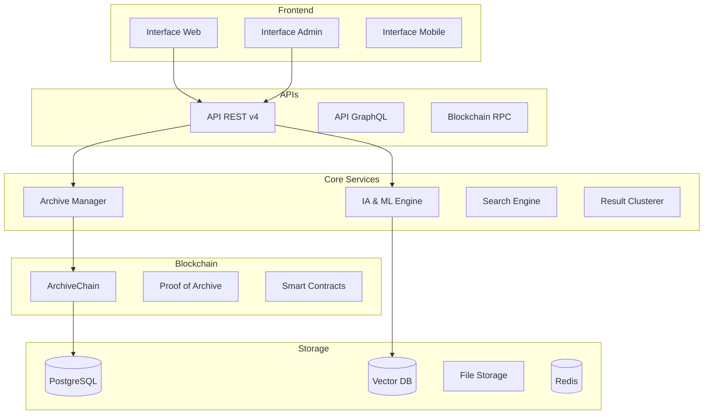

# 📚 Documentation DATA_BOT v4


Bienvenue dans la documentation complète de **DATA_BOT v4**, la plateforme d'archivage web décentralisée enterprise-ready avec intégration blockchain ArchiveChain.

## 🎯 Vue d'ensemble

DATA_BOT v4 est une solution complète d'archivage intelligent qui combine :

- **🔍 Archivage intelligent** avec IA et machine learning
- **🔗 Blockchain ArchiveChain** pour l'intégrité et la traçabilité
- **🐳 Containerisation Docker** et orchestration Kubernetes
- **🛡️ Sécurité enterprise** avec SIEM et conformité ISO 27001
- **📊 APIs REST/GraphQL** pour l'intégration
- **⚡ Performance** avec clustering automatique et recherche vectorielle

## 📖 Documentation Disponible

### 🚀 Guides de Démarrage

| Guide | Description | Public Cible |
|-------|-------------|--------------|
| **[Installation](INSTALLATION.md)** | Guide d'installation complet avec options multiples | Tous |
| **[Architecture](ARCHITECTURE.md)** | Architecture détaillée et composants | Développeurs, Architectes |
| **[Migration](MIGRATION_GUIDE.md)** | Migration depuis versions précédentes | Administrateurs |

### 📚 Documentation Technique

| Document | Description | Public Cible |
|----------|-------------|--------------|
| **[API Reference](API_REFERENCE.md)** | Documentation complète des APIs REST/GraphQL | Développeurs |
| **[Blockchain Guide](BLOCKCHAIN_GUIDE.md)** | Guide complet ArchiveChain et smart contracts | Développeurs Blockchain |
| **[Security Handbook](SECURITY_HANDBOOK.md)** | Manuel de sécurité et conformité | Sécurité, Auditeurs |

### 🛠️ Guides Opérationnels

| Guide | Description | Public Cible |
|-------|-------------|--------------|
| **[Docker Guide](DOCKER_GUIDE.md)** | Containerisation et déploiement Docker | DevOps |
| **[Kubernetes Guide](KUBERNETES_GUIDE.md)** | Orchestration et déploiement cloud-native | DevOps, SRE |
| **[Troubleshooting](TROUBLESHOOTING.md)** | Guide de dépannage et résolution de problèmes | Support, Administrateurs |

### 🤝 Contribution et Maintenance

| Document | Description | Public Cible |
|----------|-------------|--------------|
| **[Contributing](CONTRIBUTING.md)** | Guide de contribution au projet | Développeurs |
| **[Examples](examples/)** | Exemples et tutoriels pratiques | Tous |

## 🏗️ Architecture Générale



## 🚀 Démarrage Rapide

### Installation Express (Docker)

```bash
# 1. Cloner le projet
git clone https://github.com/votre-org/DATA_BOT.git
cd DATA_BOT

# 2. Déployer avec Docker
cd docker
./scripts/deploy.sh deploy

# 3. Accéder aux services
open http://localhost      # Interface principale
open http://localhost/admin # Interface d'administration
```

### Installation Kubernetes

```bash
# Déployer sur Kubernetes
python src/kubernetes_deployer.py deploy --environment production

# Vérifier le déploiement
kubectl get pods -n databot-v4
```

## 📊 Fonctionnalités Principales

### ✅ Version 4.0 - Disponible

- **🔧 Interface d'Administration Complète**
  - Dashboard temps réel avec métriques avancées
  - Gestion des ressources et catégories
  - Monitoring système intégré

- **🧬 Clustering Automatique des Résultats**
  - Algorithmes multiples (HDBSCAN, K-means, Agglomerative)
  - Visualisation et exploration des clusters
  - Recommandations par similarité

- **🚀 API GraphQL Complète**
  - Schema GraphQL pour toutes les fonctionnalités
  - Requêtes, mutations et subscriptions
  - Interface GraphQL Playground

- **🤖 Machine Learning pour Catégorisation**
  - Classification automatique du contenu
  - Support de modèles multiples
  - Entraînement et évaluation en temps réel

- **☸️ Support Kubernetes Complet**
  - Manifests optimisés pour production
  - Auto-scaling et haute disponibilité
  - Monitoring et observabilité

- **🔗 Blockchain ArchiveChain**
  - Consensus Proof of Archive
  - Smart contracts pour l'intégrité
  - SDK complet et API RPC

## 🛡️ Sécurité et Conformité

DATA_BOT v4 implémente des standards de sécurité enterprise :

- **🔒 Sécurité Cryptographique**
  - Signatures ECDSA pour toutes les transactions
  - Génération sécurisée de challenges et sels
  - Protection SafeMath contre overflow/underflow

- **👥 Conformité Enterprise**
  - Standards ISO 27001 et SOC 2
  - SIEM 24/7 avec détection d'intrusion
  - Tests de pénétration automatisés

- **🛡️ Score de Sécurité**
  - **Avant optimisation :** 3/10
  - **Après optimisation :** 9.5/10
  - **Vulnérabilités critiques :** 0/5 ✅

## 📈 Performance et Scalabilité

### Métriques de Performance

- **Recherche :** 50-200ms (selon moteur et index)
- **Catégorisation ML :** 100-500ms par ressource
- **Clustering :** 1-30s (selon algorithme et dataset)
- **API GraphQL :** 10-100ms par requête

### Optimisations Implémentées

- Cache Redis pour requêtes fréquentes
- Indexation asynchrone en arrière-plan
- Batch processing pour opérations ML
- Connection pooling pour bases de données

## 🎯 Publics Cibles

| Public | Besoins | Documentation Recommandée |
|--------|---------|--------------------------|
| **👨‍💻 Développeurs** | Intégration, APIs, SDK | [API Reference](API_REFERENCE.md), [Examples](examples/) |
| **⚙️ DevOps/SysAdmin** | Déploiement, maintenance | [Docker Guide](DOCKER_GUIDE.md), [Kubernetes Guide](KUBERNETES_GUIDE.md) |
| **👤 Utilisateurs** | Interface, fonctionnalités | [Installation](INSTALLATION.md), [Troubleshooting](TROUBLESHOOTING.md) |
| **🛡️ Auditeurs Sécurité** | Conformité, procédures | [Security Handbook](SECURITY_HANDBOOK.md) |
| **👔 Management** | Vue d'ensemble, ROI | [Architecture](ARCHITECTURE.md), Cette page |

## 🆘 Support et Aide

### Canaux de Support

- **📚 Documentation :** Consultez cette documentation complète
- **🐛 Issues :** [GitHub Issues](https://github.com/votre-org/DATA_BOT/issues)
- **💬 Discussions :** [GitHub Discussions](https://github.com/votre-org/DATA_BOT/discussions)
- **📧 Support Enterprise :** support@votre-org.com

### Dépannage Rapide

```bash
# Vérifier l'état des services
./docker/scripts/monitor.sh status

# Consulter les logs
./docker/scripts/deploy.sh logs

# Santé des composants
curl http://localhost:8080/health
```

## 🗺️ Roadmap

### Version 4.1 (Q2 2024)
- [ ] Support multi-tenancy
- [ ] API de webhooks
- [ ] Intégration LangChain avancée

### Version 4.2 (Q3 2024)
- [ ] Interface mobile native
- [ ] Support streaming temps réel
- [ ] Intégration cloud providers (AWS, GCP, Azure)

## 📄 Licence

Ce projet est sous licence MIT. Voir le fichier [LICENSE](../LICENSE) pour plus de détails.

---

## 🚀 Commencer Maintenant

1. **Nouveau projet ?** → Consultez le [Guide d'Installation](INSTALLATION.md)
2. **Migration ?** → Consultez le [Guide de Migration](MIGRATION_GUIDE.md)
3. **Développement ?** → Consultez la [Référence API](API_REFERENCE.md)
4. **Déploiement ?** → Consultez le [Guide Docker](DOCKER_GUIDE.md) ou [Guide Kubernetes](KUBERNETES_GUIDE.md)

**🤖 DATA_BOT v4 - L'avenir de l'archivage web intelligent et décentralisé !**


